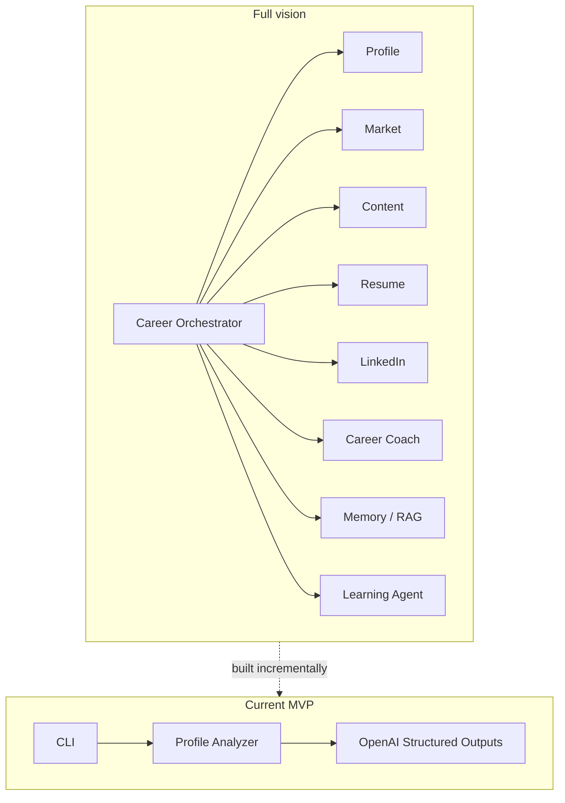

# 1. Overview – What exists right now?

## Project goal

**Career AI Assistant** is a multi-agent system for career management:

- Analyze LinkedIn / CV profiles
- Identify skill gaps
- Tailor resumes
- Create professional content
- Keep long-term memory about the user

We are currently at **MVP Stage 2**: one agent working end-to-end.

## What is implemented

| Component | Status | Key files |
|-----------|--------|-----------|
| Agent folder structure | Scaffold | `app/agents/*` |
| Pydantic profile models | Done | `app/models/profile.py` |
| Profile Analyzer Agent | Done | `app/agents/profile/agent.py` |
| OpenAI Structured Outputs | Done | `app/tools/llm.py` |
| Prompt templates | Done | `app/prompts/profile.py` |
| Settings from `.env` | Done | `app/config.py` |
| CLI | Done | `app/cli.py` |
| Sample input | Done | `examples/sample_profile.json` |
| Tests | Done (4 tests) | `tests/` |
| Memory / RAG | Empty | `app/memory/` |
| Orchestrator / Workflows | Empty | `app/workflows/` |
| FastAPI | Empty | `app/api/` |
| Other agents | Placeholders | `linkedin`, `resume`, `jobs`, `coach`, `content`, `skills` |

## What the system can do today

```text
Profile JSON
      │
      ▼
ProfileAnalyzerAgent
      │
      ▼
Structured JSON:
  score, strengths, weaknesses,
  missing_skills, recommendations
```

In short: **profile analysis against a career goal** — not yet job search / content writing / memory.

## Code size (current)

- About **440 lines of Python** (excluding `.venv`)
- One real agent + shared infrastructure
- Remaining folders are ready for expansion (mostly empty `__init__.py` files)

## Vision vs reality



## Why start with the Profile Agent?

1. It defines the user's **data contract** (who you are, goal, experience).
2. Other agents (Skills, Coach, Content) can build on top of it.
3. It teaches the core project pattern:
   **Pydantic Input → Prompt → LLM Structured Output → Pydantic Output**.

## Recommended next steps

1. Skills Agent – deeper skill-gap analysis
2. Career Coach Agent – learning plan
3. Content Agent – first LinkedIn post
4. Memory – persist analyses over time

Architecture details: [03-architecture.md](./03-architecture.md)
