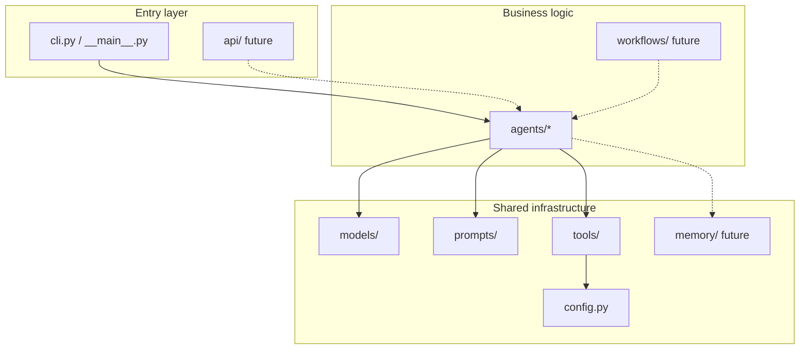

# 2. Project structure

## Directory tree (what exists)

```text
career-ai/
├── app/                         # Application code
│   ├── __init__.py
│   ├── __main__.py              # Enables: python -m app
│   ├── cli.py                   # Terminal entrypoint
│   ├── config.py                # Settings from .env
│   ├── agents/                  # All agents
│   │   ├── profile/             # Implemented
│   │   │   ├── __init__.py
│   │   │   └── agent.py
│   │   ├── linkedin/            # Placeholder
│   │   ├── resume/              # Placeholder
│   │   ├── jobs/                # Placeholder
│   │   ├── coach/               # Placeholder
│   │   ├── content/             # Placeholder
│   │   └── skills/              # Placeholder
│   ├── models/                  # Shared Pydantic models
│   │   └── profile.py           # Done
│   ├── prompts/                 # Prompt templates
│   │   └── profile.py           # Done
│   ├── tools/                   # Shared tools (LLM, etc.)
│   │   └── llm.py               # Done
│   ├── memory/                  # Future – RAG / memory
│   ├── workflows/               # Future – Orchestrator
│   └── api/                     # Future – FastAPI
├── tests/                       # Tests
├── examples/                    # Sample inputs
├── docs/                        # Documentation (this folder)
├── scripts/                     # Helpers (git push)
├── docker/                      # Future
├── pyproject.toml               # Dependencies + tooling config
├── uv.lock                      # Locked dependency versions
├── .env.example                 # Secret template (no real values)
├── .env                         # Local secrets (not in git)
├── .gitignore
└── README.md
```

## Why this layout?



### Key principle

- **`agents/`** = what the system can do (capabilities)
- **`models/`** = how data looks (contracts)
- **`prompts/`** = how we talk to the LLM (instructions)
- **`tools/`** = how we connect outward (OpenAI, etc.)
- **`cli.py` / `api/`** = how the user invokes the system

This lets us replace CLI with an API later without rewriting the agent.

## File → responsibility map

| File | Single responsibility |
|------|------------------------|
| `app/config.py` | Load settings and secrets |
| `app/models/profile.py` | Validate and shape profile data |
| `app/prompts/profile.py` | LLM instruction text |
| `app/tools/llm.py` | Call OpenAI + parse structured output |
| `app/agents/profile/agent.py` | Orchestrate the analysis |
| `app/cli.py` | Read JSON file and print result |
| `tests/*` | Verify contracts and flow |

## What does "placeholder" mean?

Folders like `app/agents/jobs/` currently contain only empty / nearly empty `__init__.py` files.

This is intentional: they reserve a place in the architecture without premature implementation.

## Root-level project files

| File | Role |
|------|------|
| `pyproject.toml` | Package name, dependencies, `career-ai` script, pytest/ruff config |
| `uv.lock` | Exact versions for reproducible installs |
| `.env` | Local secrets (`OPENAI_API_KEY`, `GITHUB_TOKEN`) – **not in git** |
| `.env.example` | Safe shared template |
| `examples/sample_profile.json` | Sample input for CLI runs |

## How Python finds the `app` package

In `pyproject.toml`:

```toml
[tool.pytest.ini_options]
pythonpath = ["."]
```

With `uv sync`, the package is installed in editable mode, so imports like:

```python
from app.agents.profile import ProfileAnalyzerAgent
```

work in both tests and the CLI.
