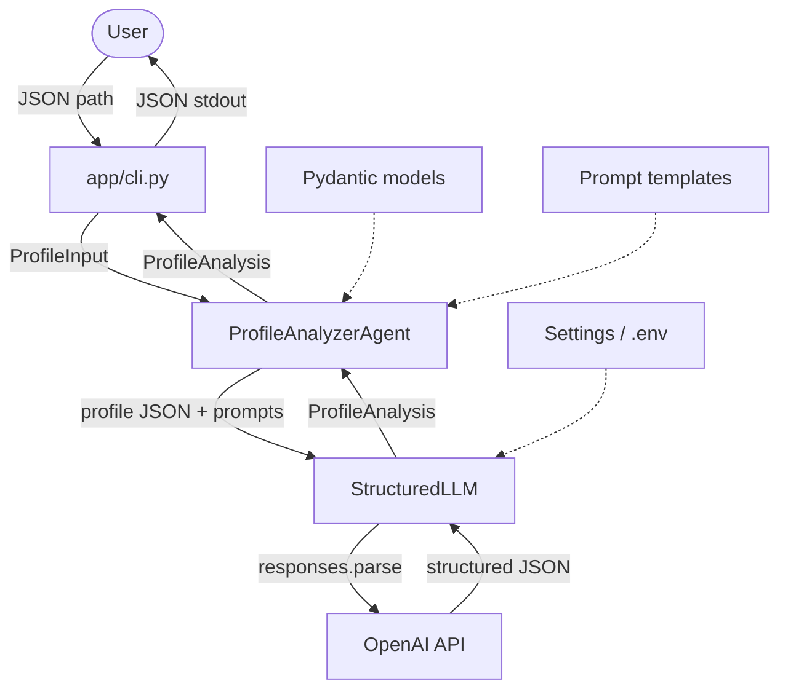
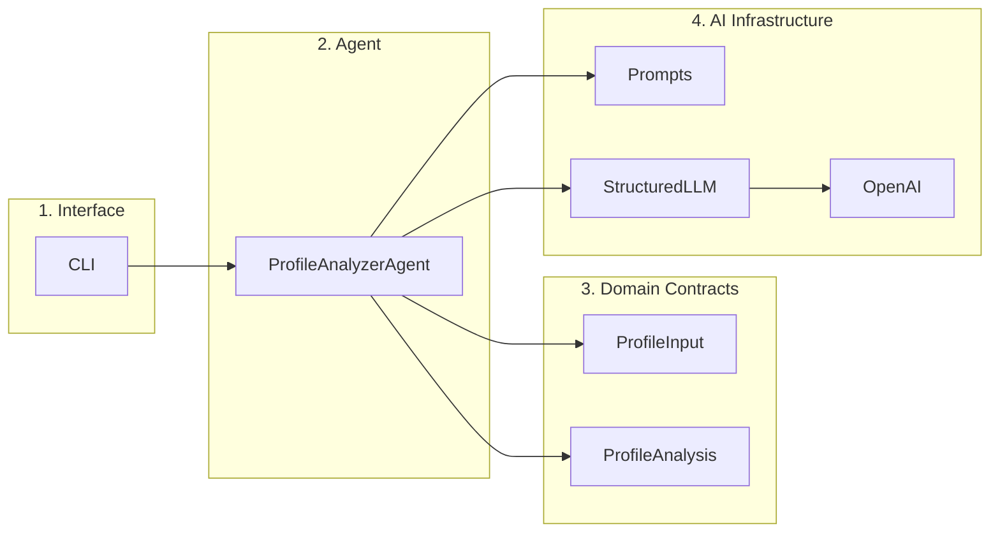
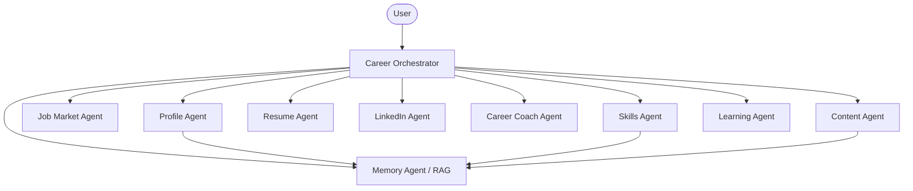
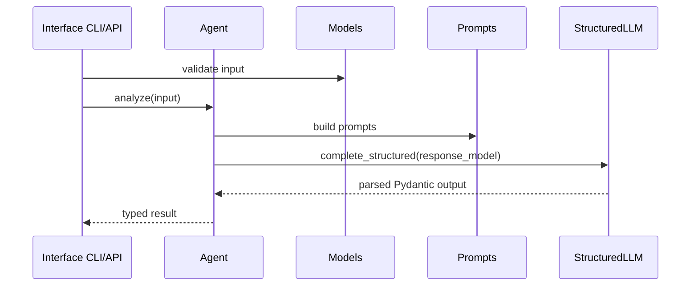

# 3. Architecture

## MVP big picture



## Responsibility layers



| Layer | Question it answers | Allowed dependencies |
|-------|---------------------|----------------------|
| Interface | How do we invoke it? | Agent + Models |
| Agent | What is the business flow? | Models, Prompts, Tools |
| Domain Contracts | What does the data look like? | Pydantic only |
| AI Infrastructure | How do we talk to the LLM? | OpenAI SDK + Settings |

## Target architecture (future)

This is the full vision from the product spec – **not implemented yet**:



The current MVP is only the **Profile Agent** node, invoked manually via CLI instead of an Orchestrator.

## Design principles already in use

### 1. Typed contracts before the LLM
Input and output are Pydantic models.  
The LLM does not return free-form text — it returns a structure that is validated.

### 2. Thin agents, thicker tools
`ProfileAnalyzerAgent` does not know OpenAI HTTP details.  
It only builds prompts and calls `StructuredLLM`.

### 3. Dependency injection for tests
You can pass a fake `llm=` into the agent:

```python
ProfileAnalyzerAgent(llm=fake_llm)
```

Tests then need no real network calls.

### 4. Central config
All runtime settings (model, API key, log level) go through `Settings`.

## Repeatable pattern for every future agent

Every new agent should look like this:

```text
app/agents/<name>/
  agent.py          # Agent class
  __init__.py       # Public export

app/models/<name>.py     # Input/Output models
app/prompts/<name>.py    # system/user prompts
tests/test_<name>_agent.py
```

Shared flow:



## What is still missing architecturally

| Component | Why we need it |
|-----------|----------------|
| Orchestrator (`workflows/`) | Connect multiple agents into a full MVP flow |
| Memory (`memory/`) | Remember analyses, goals, writing style |
| API (`api/`) | Interface beyond CLI |
| Job / Content / Resume Agents | Next product capabilities |

## One-sentence summary

The current architecture is a **single typed pipeline** from profile JSON to analysis JSON, with a scaffold ready to grow into a multi-agent system.
