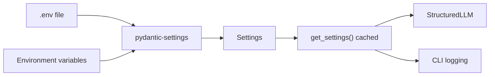
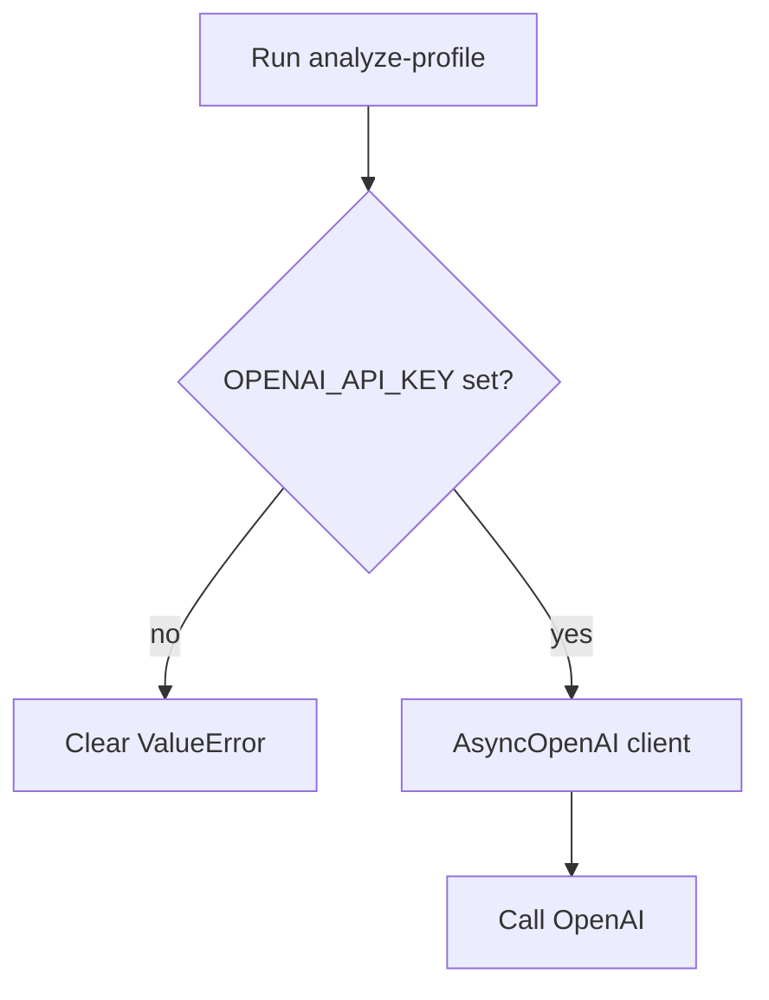

# 4. Config and secrets

## Main file

`app/config.py` – loads settings from environment variables / `.env`.

## How it works



## `Settings` fields

| Field | Env var | Default | Used for |
|-------|---------|---------|----------|
| `openai_api_key` | `OPENAI_API_KEY` | `""` | OpenAI auth |
| `openai_model` | `OPENAI_MODEL` | `gpt-4o-mini` | Model name |
| `log_level` | `LOG_LEVEL` | `INFO` | CLI log level |

### Important behavior

1. `env_file=".env"` – reads the local file automatically.
2. `extra="ignore"` – unknown `.env` keys (e.g. `GITHUB_TOKEN`) do **not** break loading.
3. `get_settings()` is wrapped with `@lru_cache` – created once per process.
4. `require_openai_api_key()` raises a clear error if the key is missing.

## Environment files

### `.env` (local, not in git)

Contains real secrets:

```bash
OPENAI_API_KEY=...
OPENAI_MODEL=gpt-4o-mini
LOG_LEVEL=INFO
GITHUB_USERNAME=shira-ozana
GITHUB_TOKEN=...
```

### `.env.example` (tracked in git)

Safe template without real secrets – documents which variables are needed.

## Who consumes config?

| Consumer | What it uses |
|----------|--------------|
| `StructuredLLM` | `openai_api_key`, `openai_model` |
| `cli.py` | `log_level` |
| `scripts/git-push.sh` | `GITHUB_USERNAME`, `GITHUB_TOKEN` (directly from `.env`, not via Settings) |

> Note: `GITHUB_TOKEN` is only for git push. The Profile Agent itself does not need it.

## Common failure flow



## Why pydantic-settings?

- Type-safe: config mistakes fail early
- Self-documenting: class fields are the spec
- Easy to test: you can pass `Settings(...)` manually into `StructuredLLM`

## Security rules

1. Never commit `.env`
2. Never paste tokens into chat / README
3. When switching machines – copy `.env` separately (not via GitHub)
4. `.gitignore` already ignores `.env` and `.env.*` (except `.env.example`)
