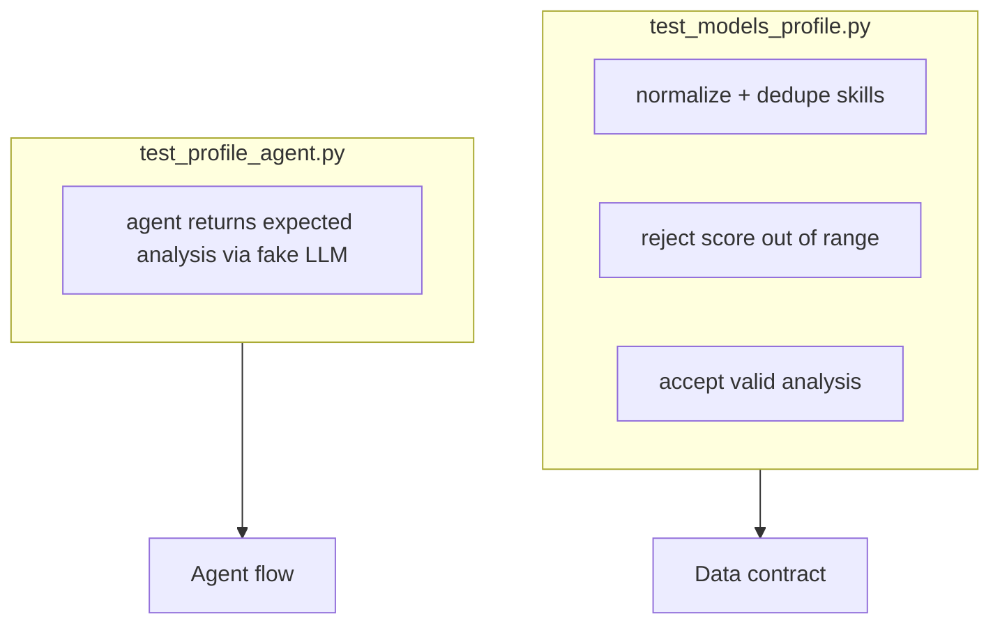

# 10. Tests

## Location

```text
tests/
├── __init__.py
├── test_models_profile.py
└── test_profile_agent.py
```

## How to run

```bash
uv run pytest
uv run pytest -q
uv run pytest tests/test_models_profile.py -v
```

Relevant settings in `pyproject.toml`:

```toml
[tool.pytest.ini_options]
asyncio_mode = "auto"
testpaths = ["tests"]
pythonpath = ["."]
```

## Logical coverage map



## Test details

### `test_profile_input_normalizes_and_dedupes_skills`

Ensures:

```python
skills=["Python", " python ", "FastAPI", "PYTHON"]
```

becomes:

```python
["Python", "FastAPI"]
```

### `test_profile_analysis_score_bounds`

Ensures `score=120` fails with `ValidationError`.

### `test_profile_analysis_accepts_valid_payload`

Ensures a valid payload is constructed correctly.

### `test_profile_agent_returns_structured_analysis`

Tests the agent end-to-end **without OpenAI**:

1. Creates `FakeStructuredLLM` returning a fixed result
2. Injects it via `ProfileAnalyzerAgent(llm=...)`
3. Asserts the result matches expectations
4. Asserts exactly one LLM call happened
5. Asserts the schema sent is `ProfileAnalysis`
6. Asserts the user prompt contains the person's name

## Why a Fake LLM instead of mocking the SDK?

Because we test **our usage contract**:

```python
await llm.complete_structured(...)
```

not the internal details of the OpenAI SDK.

## What is not covered yet

| Gap | Future test type |
|-----|------------------|
| CLI file reading | `main(...)` test with temp JSON |
| Missing API key failure | unit test for `require_openai_api_key` |
| Real OpenAI integration | optional marked test (`@pytest.mark.integration`) |
| Prompt regression | evaluation suite with gold examples |

## Lint

In addition to pytest:

```bash
uv run ruff check app tests
```

Ruff checks style, imports, and basic issues based on `pyproject.toml`.
