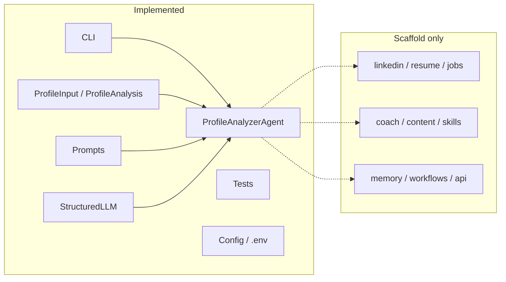

# Career AI – Project Documentation

Complete guide to what exists in the codebase today (MVP – Profile Analyzer Agent).

## How to read these docs

Recommended order:

| # | Document | What you will learn |
|---|----------|---------------------|
| 1 | [Overview](./01-overview.md) | What works today vs what is planned |
| 2 | [Project structure](./02-project-structure.md) | Every folder/file and why it exists |
| 3 | [Architecture](./03-architecture.md) | Layers, principles, diagrams |
| 4 | [Config and secrets](./04-config.md) | Settings, `.env`, environment variables |
| 5 | [Models (Pydantic)](./05-models.md) | Profile input/output contracts |
| 6 | [Prompts](./06-prompts.md) | How we instruct the LLM |
| 7 | [LLM client](./07-llm-client.md) | OpenAI Structured Outputs |
| 8 | [Profile Agent](./08-profile-agent.md) | First agent end-to-end |
| 9 | [CLI](./09-cli.md) | How to run from the terminal |
| 10 | [Tests](./10-tests.md) | What is tested and why |
| 11 | [Data flow](./11-data-flow.md) | Full sequence diagram |
| 12 | [Scripts and tooling](./12-scripts-and-tooling.md) | git-push, uv, pytest, ruff |
| 13 | [Deterministic boundaries](./13-deterministic-boundaries.md) | What can leave the LLM and become rules |
| 14 | [Code walkthrough](./14-code-walkthrough.md) | Learn the implemented code before changing it |

## Quick status map



## Quick start

```bash
cd ~/Downloads/career-ai
uv sync --extra dev
cp .env.example .env   # if you do not have .env yet
# Add OPENAI_API_KEY in .env

uv run career-ai analyze-profile examples/sample_profile.json
uv run pytest
```

## Learning principle

Every component is built in three steps:

1. **Learn** – why we chose the technology
2. **Plan** – how it fits the architecture
3. **Build** – code + tests

These docs describe the current MVP and clearly mark what is not implemented yet.
