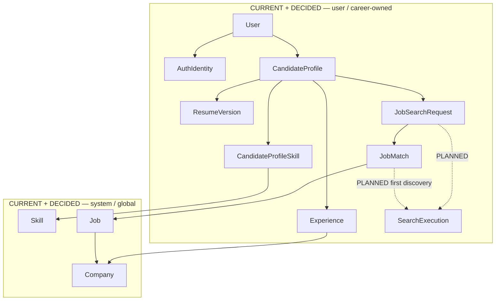
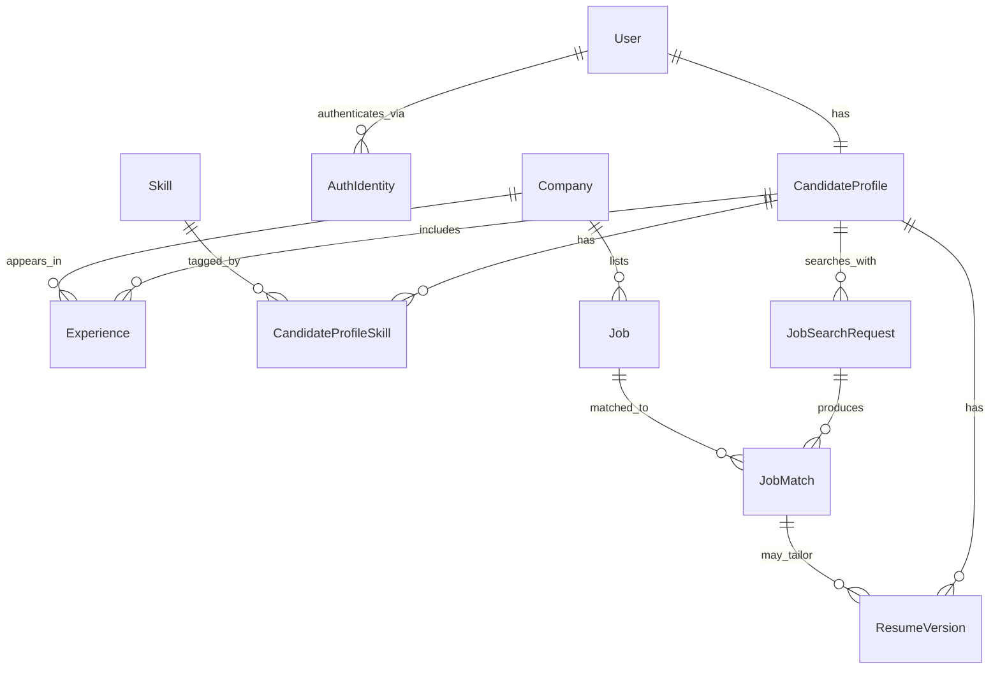
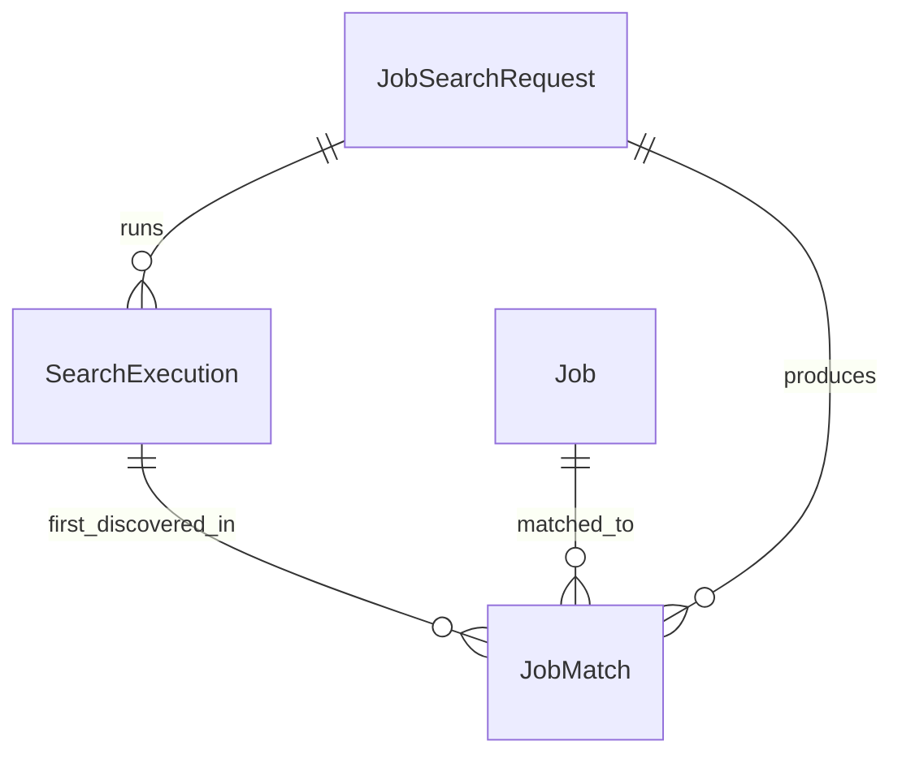

# Data architecture

This page covers persistent career-domain data: what is **implemented** in the current schema, what is **decided** as design, and what remains **proposed** or a **future consideration**.

The runtime analysis contract (`ProfileInput` / `ProfileAnalysis`) is documented in [Models](../design/models.md). That contract is **not** the canonical Candidate Profile described here, and it is **not** the future CV/LinkedIn ingestion payload.

Status of topics on this page:

| Topic | Design status |
|-------|----------------|
| User vs Candidate Profile | Decided |
| AuthIdentity vs User | Decided; in the schema |
| User-owned vs global catalog ownership | Decided; see [Ownership](#ownership) |
| Structured ingestion, not wholesale raw docs | Decided |
| Conflict detection + HITL | Decided |
| Application services own persistence and authorization | Decided; not implemented. [ADR 003](../adr/003-application-owns-workflows.md) |
| Initial relational schema | **Implemented** (ORM + Alembic; not wired to agents) |
| JobSearchRequest as user-owned search intent | Decided; in the schema under `CandidateProfile` |
| SearchExecution | **Planned** — not in the schema |
| JobMatch belongs to a search request + job | Decided; in the schema |
| JobMatch first-discovered execution | **Planned** — field name deferred |
| ResumeVersion (replaces TailoredCV) | Decided; in the schema |
| Skill / Company normalization | Decided; in the schema |
| Company future service ownership | **Open question** — do not redesign now |
| Education / Institution | Future — not in this schema |
| Job status vs Job freshness | Decided conceptually; freshness columns **deferred** |
| Object storage for source/resume files | Future consideration — not implemented |
| One PostgreSQL database for the monolith | **Decided** and **implemented** |
| JSONB for selectively flexible fields | Future consideration — not a current requirement |
| Vector / semantic database | Future consideration — not a current requirement |
| Database-per-service / distributed transactions | **Not** the current strategy |

Setup, migrations, and package layout: [Database](../development/database.md). Decision records: [ADR 001](../adr/001-postgresql.md), [ADR 002](../adr/002-modular-monolith.md). Job Search pipeline: [Job Search](job-search.md).

## Ownership

**Decided.** Logical ownership is independent of whether Career AI later extracts Job Search.



Rules:

- User-owned resources are only accessed or mutated in an authenticated actor context.
- Application services enforce that ownership. Repositories are not the sole authorization layer.
- Global catalog rows (`Job`, `Company`, `Skill`) are shared system data, not owned by a search or a user.
- `JobMatch` is user-specific **through** its `JobSearchRequest`.
- `JobSearchRequest` is persistent search intent. It is not a search-engine run.
- Search history belongs to Career AI user state and must survive replacement or extraction of the Job Search implementation.

### Current persistence vs logical ownership

**Implemented:** `job_search_requests.candidate_profile_id` references `CandidateProfile`, which is 1:1 with `User`. That is compatible with user-owned intent today.

**Not decided now:** whether `JobSearchRequest` should later hang directly off `User` instead of `CandidateProfile`. Re-parenting is not required for this architecture alignment.

Cascade delete from `CandidateProfile` to `JobSearchRequest` is the current schema. That is a profile-lifecycle behavior, not a statement that search intent belongs to a future Job Search service.

## Persistent candidate state

**Decided.**

Account identity and career-domain data are different concerns:

| Concept | Role |
|---------|------|
| **User** | Application-level identity and contact information |
| **AuthIdentity** | Link from a User to an external authentication provider subject |
| **Candidate Profile** | Canonical structured representation of the user's professional profile |

```text
User  1 ────── 1  CandidateProfile
User  1 ────── N  AuthIdentity
```

Rules:

- One active Candidate Profile per User (`candidate_profiles.user_id` is unique).
- Update that profile as information changes. Do not keep multiple simultaneously active profiles.
- Authentication providers must not replace User. A User can have many AuthIdentity rows (for example one per provider).
- Do **not** store passwords on User. Authentication logic is not implemented in this schema.
- Historical analyses, recommendations, actions, or changes may be stored **separately** so continuity is preserved without forking the canonical profile.

`CandidateProfile` is canonical professional state. It must **not** contain job-search targeting fields such as `target_title`. Search intent lives on `JobSearchRequest`.

## CV and LinkedIn ingestion

**Decided** as a design principle. **Not implemented** in the running application.

Raw CV and LinkedIn documents must not be passed wholesale through every downstream agent.

Parse and **normalize** sources into a **structured representation**, for example:

- skills
- experience
- education (schema not in this revision)
- projects
- professional / profile metadata

Downstream components should use **selective retrieval**: read only the structured fields they need, from **persistent state**, when possible.

Original source files will eventually live in **object storage**. Meaningful parsed professional information is persisted as structured rows (`CandidateProfile`, `Experience`, `CandidateProfileSkill`, and later education). Object storage is **not implemented**.

Vector / semantic retrieval is **not** a current requirement. Reconsider it only if a concrete use case needs it.

The next implementation milestone does **not** ingest files. It persists already-structured JSON. See [Next implementation milestone](overview.md#next-implementation-milestone).

## Conflicting data and human-in-the-loop

**Decided.** **Not implemented.**

CV and LinkedIn will disagree. The system must not silently pick a winner.

1. Detect conflicts.
2. Preserve source provenance (which source asserted which value).
3. Do not silently choose one source as correct.
4. Represent important unresolved fields as unresolved / ambiguous.
5. Let the user resolve important conflicts through **Human-in-the-Loop (HITL)** validation.
6. Update the canonical Candidate Profile after validation.

Downstream agents must not treat unresolved critical information as verified truth.

Conflict/provenance tables are **not** part of the current schema. The structured-JSON Profile Ingestion slice does not require them.

## Data access principles

**Decided.** Not implemented. The next Profile Ingestion slice introduces the first application service and repository.

Avoid:

```text
API → Agent → direct DB access
```

Prefer:

```text
API / CLI
  → Application / Workflow
    → Domain / Application Service
      → Agent capability when needed
        → Repository
          → PostgreSQL
```

Principles:

- The application layer owns sequencing, persistence, transactions, authorization, retries, and status handling.
- Agents are capabilities with explicit input/output contracts.
- Do not pass SQLAlchemy ORM objects across module boundaries where a stable contract should exist.
- **Least privilege** — each caller gets only the operations it needs
- **Controlled writes** — not ad-hoc agent updates to canonical data
- **Validation before persistent changes**
- **Auditability** of reads/writes that matter
- **HITL approval** for important changes to canonical user data where appropriate
- Repositories load and store data. They are not the authorization system.

The current codebase has ORM models, engine/session helpers, and an Alembic migration. It does **not** yet have repositories, a service layer, or Agent → DB integration.

For a future Job Search extraction, prefer a transport-friendly contract such as `CandidateSearchContext` / `SearchExecutionRequest`. Today that may be an in-process Python object.

## Implemented relational schema

**Implemented** as SQLAlchemy models and the initial Alembic migration. Agents and the CLI do **not** read or write these tables yet.

### Core entities

| Entity | Role | Ownership |
|--------|------|-----------|
| User | Application identity and contact information | User |
| AuthIdentity | External authentication subject linked to a User | User |
| CandidateProfile | Canonical professional profile | User |
| Experience | One role/period on the profile | User, via profile |
| Skill | Reusable skill entity | Global catalog |
| CandidateProfileSkill | Profile ↔ Skill junction | User, via profile |
| Company | Reusable organization (experience and jobs) | Global; future split **unresolved** |
| Job | System-level catalog entry | Global catalog |
| JobSearchRequest | Intent/criteria for one job search | User-owned intent |
| JobMatch | Match between one search request and one job | User, via search request |
| ResumeVersion | A meaningful resume representation (original, generic, or tailored) | User, via profile |

**Not in this schema:** `SearchExecution`, education/institution, freshness columns, source-policy columns, `SourceExecution`, conflict/provenance tables, workflow/conversation state.

### Relationships (implemented)

```text
User                1 : 1    CandidateProfile
User                1 : N    AuthIdentity
CandidateProfile    1 : N    Experience
Company             1 : N    Experience
CandidateProfile    N : M    Skill              via CandidateProfileSkill
Company             1 : N    Job
CandidateProfile    1 : N    JobSearchRequest
JobSearchRequest    1 : N    JobMatch
Job                 1 : N    JobMatch
CandidateProfile    1 : N    ResumeVersion
JobMatch            0 : N    ResumeVersion      (optional; used for tailored resumes)
```

`CandidateProfile` vs `JobSearchRequest`:

- **CandidateProfile** answers: who is this candidate professionally?
- **JobSearchRequest** answers: what does this candidate want to search for?
- A candidate can run multiple searches. `target_title` belongs on `JobSearchRequest`, not on `CandidateProfile`.

`JobMatch` is the result of matching **one search request** to **one job**, not a direct CandidateProfile ↔ Job table. It holds:

- match score
- match reason
- status
- timestamps

Uniqueness **implemented:** one `JobMatch` per (`JobSearchRequest`, `Job`). Repeated executions must not create duplicate matches merely because the same job was rediscovered.

`ResumeVersion` replaces the earlier conceptual `TailoredCV` entity. It represents a persisted resume state, not every conversational edit:

- **original** — the uploaded/source resume representation (no `JobMatch` required)
- **generic** — a general resume derived from the canonical profile (no `JobMatch` required)
- **tailored** — a resume associated with a specific `JobMatch`

`file_reference` is metadata for a future object-storage path. Object storage itself is not implemented. Intermediate editing drafts are not retained as rows.

### Entity-relationship diagram (implemented)

This diagram is the **current** schema. Planned tables are not included here.



### Planned relationships (not in the schema)

**Planned.** Do not treat this as the current database.



`JobSearchRequest` 1:N `SearchExecution`:

- `JobSearchRequest` = persistent search intent
- `SearchExecution` = one concrete attempt/run of that search

Conceptual `SearchExecution` lifecycle (**planned**, not an implemented enum):

```text
PENDING → RUNNING → COMPLETED | PARTIAL | FAILED
```

`JobMatch` should retain the ability to identify the execution in which a match/job was **first** discovered (`discovered_in_execution` / `first_matched_execution`). The exact field name and nullability are decided **before** the migration that adds it.

Do **not** introduce full N:M execution history between `JobMatch` and `SearchExecution` now. If later access patterns need every execution in which a job appeared, add that then.

Do **not** design `SourceExecution` persistence yet. It is architecturally anticipated and deferred until the detailed Job Search flow is designed.

## Normalization

**Decided** as direction: normalize where identity is reused; do not normalize everything.

### Skills

Skills are entities, not repeated free-text values or a JSON list on `CandidateProfile`. That enables:

- consistent naming
- reuse across profiles and jobs
- analytics (for example, frequently occurring skills)
- future recommendations based on profiles and jobs

CandidateProfile ↔ Skill is many-to-many (`CandidateProfileSkill`). Proficiency, years, and confidence are **not** on the junction yet.

Today's agent contract still uses `list[str]` on `ProfileInput`. That is an I/O convenience, not the persistence model.

### Companies

`Company` is a reusable entity because it participates in both:

- candidate `Experience`
- `Job` listings

Experience stores `company_id`, not a duplicated company name.

**Open question:** which future service would own `Company` if Job Search is extracted. Do not redesign `Company` now.

### Institutions

Educational institutions may similarly be reusable entities, connected through `Education` with relationship-specific data such as degree, field of study, and dates. **Not in the current schema.**

### Limit of normalization

Do not create entities for every string. Free-form descriptions and values with no meaningful reuse stay as fields, not tables.

## Job catalog and freshness

**Decided** conceptually. The `Job` table exists. Catalog refresh, external ingestion, and freshness columns are **not implemented**.

`Job` is a **system-level** entity. It is not owned by an individual user. One job may match many search requests.

The internal Job Catalog is **always** the first search source. External discovery **enriches and refreshes** that catalog. It must not create a separate temporary universe of jobs. Pipeline: [Job Search](job-search.md).

### Status is not freshness

`jobs.status` currently allows `active` or `closed`. Status does not say whether that information was verified today or a month ago.

The architecture should support freshness metadata, for example:

- `first_seen_at`
- `last_seen_at`
- `last_verified_at`

Do **not** blindly add all three. Exact column names, nullability, and TTL are deferred until the Job Search / catalog flow is implemented.

`updated_at` on `Job` is an ORM row timestamp. It is **not** a freshness/verification clock.

### Two different clocks

| Clock | Answers | Example |
|-------|---------|---------|
| SearchExecution | When did this search run / when was this match discovered? | `SearchExecution` timestamps (**planned**) |
| Job freshness | When did we last verify that this job is still relevant/active? | freshness columns (**deferred**) |

Keep these concerns separate.

Before important actions involving a job — generating a tailored CV, beginning an application, other time-sensitive actions — the application should be able to perform **targeted verification of that individual Job** if freshness is insufficient. That must not require rerunning the entire search.

Direction, not a selected policy:

- periodic refresh of job status and data
- on-demand freshness check before important actions
- active / closed job lifecycle
- relevance filtering and ranking **before** persisting user-specific `JobMatch` rows

Trade-off: fresher data versus external calls, latency, and cost.

## Resume file storage

**Decided** as a split; file storage is **not implemented**.

Separate structured metadata from file artifacts.

| Store | Holds |
|-------|--------|
| Database | `ResumeVersion` metadata, optional `JobMatch` link, timestamps, `file_reference` |
| File / object storage | Original and generated PDF/DOCX bytes |

**Retention policy:** intermediate working drafts do not need long-term persistence. Persist meaningful resume versions rather than every generated iteration, to limit storage growth.

No object-storage product is selected. `file_reference` is a string placeholder for that future integration.

Workflow and agent conversational state will be designed later with orchestration. **Do not** treat `ResumeVersion` as a chat-log or workflow-state table.

## Database strategy

**Decided** and **implemented.**

Today:

- one PostgreSQL database
- SQLAlchemy 2.x
- Alembic
- one deployable backend

This is intentional.

Do **not** introduce:

- database-per-service
- distributed transactions
- service-specific databases

Logical ownership boundaries should nevertheless stay clear so a later split remains possible.

Supabase is the current hosted PostgreSQL provider for development. The application depends on standard PostgreSQL and SQLAlchemy abstractions, not Supabase-specific database APIs.

See [ADR 001: PostgreSQL with SQLAlchemy](../adr/001-postgresql.md).

PostgreSQL fits this domain because:

- entities are relational (User, Company, Skill, Job, Experience, search requests, matches, resume versions)
- access patterns cross entities (filter/sort `JobMatch` rows, join a search request to jobs and companies)
- reusable identities (`Company`, `Skill`) need a single source of truth
- referential integrity and uniqueness constraints matter (1:1 profile, unique provider subject, unique search+job match)
- consistency across related writes is more important here than a nested document default

JSONB remains a **future option** for selectively flexible fields. It is not used in the current schema.

MongoDB / document storage was considered while the model was still open. The domain is not a single nested Candidate Profile blob; it is a graph of reusable, constrained entities.

## Future schema changes implied by this architecture

These are **not** in the current migration. They are expected when the related flow is designed:

| Change | When |
|--------|------|
| `SearchExecution` table (`JobSearchRequest` 1:N) | Job Search implementation |
| `JobMatch` first-discovered-execution foreign key | Same design pass as `SearchExecution`; name chosen before migrate |
| Job freshness column(s) | Catalog / Job Search flow design |
| External source-policy persistence | Job Search flow design; avoid omitted-vs-empty array ambiguity |
| `SourceExecution` | Explicitly later than `SearchExecution` |
| N:M match ↔ execution history | Only if access patterns require it |
| Education / Institution | Candidate-domain expansion |
| Conflict / provenance tables | Multi-source CV/LinkedIn ingestion |

Do not add these columns or tables in the Profile Ingestion slice.
