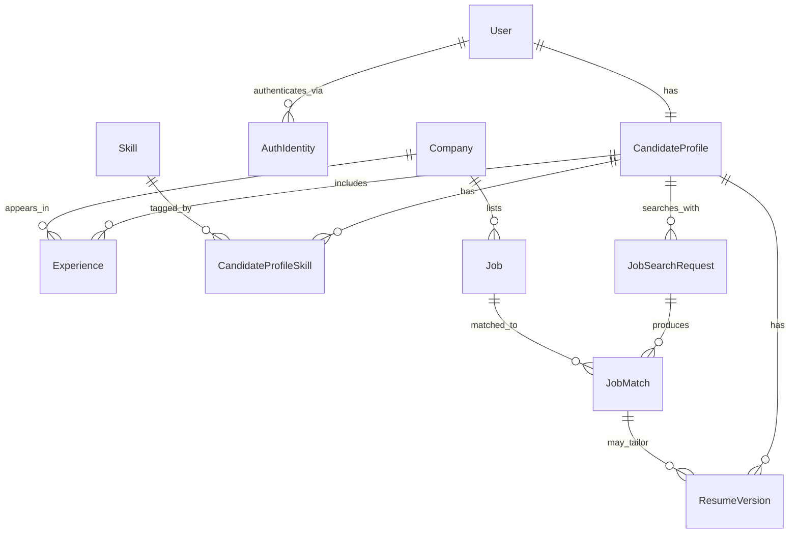

# Data architecture

This page covers persistent career-domain data: what is **implemented** in the current schema, what is **decided** as design, and what remains **proposed** or a **future consideration**.

The runtime analysis contract (`ProfileInput` / `ProfileAnalysis`) is documented in [Models](../design/models.md). That contract is **not** the canonical Candidate Profile described here, and it is **not** the future CV/LinkedIn ingestion payload.

Status of topics on this page:

| Topic | Design status |
|-------|----------------|
| User vs Candidate Profile | Decided |
| AuthIdentity vs User | Decided; in the schema |
| Structured ingestion, not wholesale raw docs | Decided |
| Conflict detection + HITL | Decided |
| Agents without unrestricted DB access | Proposed (do not implement yet) |
| Initial relational schema | **Implemented** (ORM + Alembic; not wired to agents) |
| JobSearchRequest as search intent | Decided; in the schema |
| JobMatch belongs to a search request | Decided; in the schema |
| ResumeVersion (replaces TailoredCV) | Decided; in the schema |
| Skill / Company normalization | Decided; in the schema |
| Education / Institution | Future — not in this schema |
| Active job catalog + freshness | Proposed |
| Object storage for source/resume files | Future consideration — not implemented |
| Database engine | **Decided** — PostgreSQL |
| JSONB for selectively flexible fields | Future consideration — not a current requirement |
| Vector / semantic database | Future consideration — not a current requirement |

Setup, migrations, and package layout: [Database](../development/database.md). Decision record: [ADR 001](../adr/001-postgresql.md).

## Persistent candidate state

**Decided.**

Account identity and career-domain data are different concerns:

| Concept | Role |
|---------|------|
| **User** | Application-level identity and contact information |
| **AuthIdentity** | Link from a User to an external authentication provider subject |
| **Candidate Profile** | Canonical structured representation of the user's professional profile |

```text
User  1 ────── 1  CandidateProfile
User  1 ────── N  AuthIdentity
```

Rules:

- One active Candidate Profile per User (`candidate_profiles.user_id` is unique).
- Update that profile as information changes. Do not keep multiple simultaneously active profiles.
- Authentication providers must not replace User. A User can have many AuthIdentity rows (for example one per provider).
- Do **not** store passwords on User. Authentication logic is not implemented in this schema.
- Historical analyses, recommendations, actions, or changes may be stored **separately** so continuity is preserved without forking the canonical profile.

`CandidateProfile` is canonical professional state. It must **not** contain job-search targeting fields such as `target_title`. Search intent lives on `JobSearchRequest`.

## CV and LinkedIn ingestion

**Decided** as a design principle. **Not implemented** in the running application.

Raw CV and LinkedIn documents must not be passed wholesale through every downstream agent.

Parse and **normalize** sources into a **structured representation**, for example:

- skills
- experience
- education (schema not in this revision)
- projects
- professional / profile metadata

Downstream components should use **selective retrieval**: read only the structured fields they need, from **persistent state**, when possible.

Original source files will eventually live in **object storage**. Meaningful parsed professional information is persisted as structured rows (`CandidateProfile`, `Experience`, `CandidateProfileSkill`, and later education). Object storage is **not implemented**.

Vector / semantic retrieval is **not** a current requirement. Reconsider it only if a concrete use case needs it.

## Conflicting data and human-in-the-loop

**Decided.** **Not implemented.**

CV and LinkedIn will disagree. The system must not silently pick a winner.

1. Detect conflicts.
2. Preserve source provenance (which source asserted which value).
3. Do not silently choose one source as correct.
4. Represent important unresolved fields as unresolved / ambiguous.
5. Let the user resolve important conflicts through **Human-in-the-Loop (HITL)** validation.
6. Update the canonical Candidate Profile after validation.

Downstream agents must not treat unresolved critical information as verified truth.

Conflict/provenance tables are **not** part of the current schema.

## Data access principles

**Proposed.** Do not implement this layer yet.

Agents should not receive unrestricted direct database access.

Preferred flow:

```text
Agent
  → Data Access / Service Layer
    → Authorization + Validation
      → Database
```

Principles:

- **Least privilege** — each caller gets only the operations it needs
- **Read-only access** where appropriate
- **Controlled writes** — not ad-hoc agent updates to canonical data
- **Validation before persistent changes**
- **Auditability** of reads/writes that matter
- **HITL approval** for important changes to canonical user data where appropriate

The current codebase has ORM models, engine/session helpers, and an Alembic migration. It does **not** yet have repositories, a service layer, or Agent → DB integration.

## Implemented relational schema

**Implemented** as SQLAlchemy models and the initial Alembic migration. Agents and the CLI do **not** read or write these tables yet.

### Core entities

| Entity | Role |
|--------|------|
| User | Application identity and contact information |
| AuthIdentity | External authentication subject linked to a User |
| CandidateProfile | Canonical professional profile |
| Experience | One role/period on the profile |
| Skill | Reusable skill entity |
| CandidateProfileSkill | Profile ↔ Skill junction |
| Company | Reusable organization (experience and jobs) |
| Job | System-level catalog entry; not owned by a user |
| JobSearchRequest | Intent/criteria for one job search |
| JobMatch | Match between one search request and one job |
| ResumeVersion | A meaningful resume representation (original, generic, or tailored) |

**Education** and **Institution** belong in the candidate domain. They are not in this schema. Workflow/conversation state is a separate future concept and is not persisted here.

### Relationships

```text
User                1 : 1    CandidateProfile
User                1 : N    AuthIdentity
CandidateProfile    1 : N    Experience
Company             1 : N    Experience
CandidateProfile    N : M    Skill              via CandidateProfileSkill
Company             1 : N    Job
CandidateProfile    1 : N    JobSearchRequest
JobSearchRequest    1 : N    JobMatch
Job                 1 : N    JobMatch
CandidateProfile    1 : N    ResumeVersion
JobMatch            0 : N    ResumeVersion      (optional; used for tailored resumes)
```

`CandidateProfile` vs `JobSearchRequest`:

- **CandidateProfile** answers: who is this candidate professionally?
- **JobSearchRequest** answers: what does this candidate want to search for right now?
- A candidate can run multiple searches. `target_title` belongs on `JobSearchRequest`, not on `CandidateProfile`.

`JobMatch` is the result of matching **one search request** to **one job**, not a direct CandidateProfile ↔ Job table. It holds:

- match score
- match reason
- status
- timestamps

`ResumeVersion` replaces the earlier conceptual `TailoredCV` entity. It represents a persisted resume state, not every conversational edit:

- **original** — the uploaded/source resume representation (no `JobMatch` required)
- **generic** — a general resume derived from the canonical profile (no `JobMatch` required)
- **tailored** — a resume associated with a specific `JobMatch`

`file_reference` is metadata for a future object-storage path. Object storage itself is not implemented. Intermediate editing drafts are not retained as rows.

### Entity-relationship diagram



## Normalization

**Decided** as direction: normalize where identity is reused; do not normalize everything.

### Skills

Skills are entities, not repeated free-text values or a JSON list on `CandidateProfile`. That enables:

- consistent naming
- reuse across profiles and jobs
- analytics (for example, frequently occurring skills)
- future recommendations based on profiles and jobs

CandidateProfile ↔ Skill is many-to-many (`CandidateProfileSkill`). Proficiency, years, and confidence are **not** on the junction yet.

Today's agent contract still uses `list[str]` on `ProfileInput`. That is an I/O convenience, not the persistence model.

### Companies

`Company` is a reusable entity because it participates in both:

- candidate `Experience`
- `Job` listings

Experience stores `company_id`, not a duplicated company name.

### Institutions

Educational institutions may similarly be reusable entities, connected through `Education` with relationship-specific data such as degree, field of study, and dates. **Not in the current schema.**

### Limit of normalization

Do not create entities for every string. Free-form descriptions and values with no meaningful reuse stay as fields, not tables.

## Job catalog and freshness

**Proposed.** The `Job` table exists. Do not design or implement the external job-ingestion pipeline yet.

`Job` is a **system-level** entity. It is not owned by an individual user. One job may match many search requests.

Direction: maintain an **active catalog** of jobs rather than starting every user search entirely from external sources.

The system should consider:

- periodic refresh of job status and data
- `last_checked_at` (or equivalent) freshness metadata
- an on-demand freshness check before important actions when appropriate
- active / closed job lifecycle (`jobs.status` currently allows `active` or `closed`)
- relevance filtering and ranking **before** persisting user-specific `JobMatch` rows

Trade-off: fresher data versus external calls, latency, and cost. Catalog refresh policy is not decided beyond these constraints.

## Resume file storage

**Decided** as a split; file storage is **not implemented**.

Separate structured metadata from file artifacts.

| Store | Holds |
|-------|--------|
| Database | `ResumeVersion` metadata, optional `JobMatch` link, timestamps, `file_reference` |
| File / object storage | Original and generated PDF/DOCX bytes |

**Retention policy:** intermediate working drafts do not need long-term persistence. Persist meaningful resume versions rather than every generated iteration, to limit storage growth.

No object-storage product is selected. `file_reference` is a string placeholder for that future integration.

Workflow and agent conversational state will be designed later with orchestration. **Do not** treat `ResumeVersion` as a chat-log or workflow-state table.

## Database decision

**Decided.** PostgreSQL is the primary relational database. Supabase is the current hosted PostgreSQL provider for development. The application depends on standard PostgreSQL and SQLAlchemy abstractions, not Supabase-specific database APIs.

See [ADR 001: PostgreSQL with SQLAlchemy](../adr/001-postgresql.md).

PostgreSQL fits this domain because:

- entities are relational (User, Company, Skill, Job, Experience, search requests, matches, resume versions)
- access patterns cross entities (filter/sort `JobMatch` rows, join a search request to jobs and companies)
- reusable identities (`Company`, `Skill`) need a single source of truth
- referential integrity and uniqueness constraints matter (1:1 profile, unique provider subject, unique search+job match)
- consistency across related writes is more important here than a nested document default

JSONB remains a **future option** for selectively flexible fields. It is not used in the current schema.

MongoDB / document storage was considered while the model was still open. The domain is not a single nested Candidate Profile blob; it is a graph of reusable, constrained entities.
