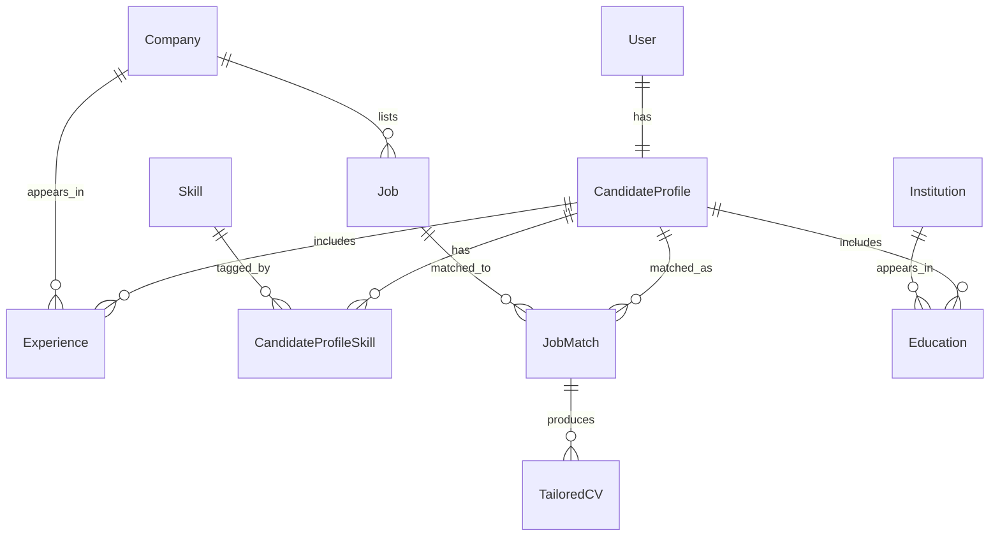

# Data architecture

**Proposed** conceptual model for persistent career-domain data. **Not implemented.** There is no database, object store, or data-access layer in the current codebase.

The runtime analysis contract (`ProfileInput` / `ProfileAnalysis`) is documented in [Models](../design/models.md). That contract is **not** the canonical Candidate Profile described here.

Status of topics on this page:

| Topic | Design status |
|-------|----------------|
| User vs Candidate Profile | Decided |
| Structured ingestion, not wholesale raw docs | Decided |
| Conflict detection + HITL | Decided |
| Agents without unrestricted DB access | Proposed (do not implement yet) |
| Conceptual entities and relationships | Proposed |
| Skill / Company / Institution normalization | Decided as direction, not schema-complete |
| Active job catalog + freshness | Proposed |
| Tailored CV metadata vs files | Proposed |
| Database engine | **Open question** |
| Vector / semantic database | Future consideration — not a current requirement |

## Persistent candidate state

**Decided.**

Account identity and career-domain data are different concerns:

| Concept | Role |
|---------|------|
| **User** | Account / identity |
| **Candidate Profile** | Canonical structured representation of the user's professional profile |

```text
User  1 ────── 1  CandidateProfile
```

Rules:

- One active Candidate Profile per User.
- Update that profile as information changes. Do not keep multiple simultaneously active profiles.
- Historical analyses, recommendations, actions, or changes may be stored **separately** so continuity is preserved without forking the canonical profile.

## CV and LinkedIn ingestion

**Decided** as a design principle.

Raw CV and LinkedIn documents must not be passed wholesale through every downstream agent.

Parse and **normalize** sources into a **structured representation**, for example:

- skills
- experience
- education
- projects
- professional / profile metadata

Downstream components should use **selective retrieval**: read only the structured fields they need, from **persistent state**, when possible.

Vector / semantic retrieval is **not** a current requirement. Reconsider it only if a concrete use case needs it.

## Conflicting data and human-in-the-loop

**Decided.**

CV and LinkedIn will disagree. The system must not silently pick a winner.

1. Detect conflicts.
2. Preserve source provenance (which source asserted which value).
3. Do not silently choose one source as correct.
4. Represent important unresolved fields as unresolved / ambiguous.
5. Let the user resolve important conflicts through **Human-in-the-Loop (HITL)** validation.
6. Update the canonical Candidate Profile after validation.

Downstream agents must not treat unresolved critical information as verified truth.

## Data access principles

**Proposed.** Do not implement this layer yet.

Agents should not receive unrestricted direct database access.

Preferred flow:

```text
Agent
  → Data Access / Service Layer
    → Authorization + Validation
      → Database
```

Principles:

- **Least privilege** — each caller gets only the operations it needs
- **Read-only access** where appropriate
- **Controlled writes** — not ad-hoc agent updates to canonical data
- **Validation before persistent changes**
- **Auditability** of reads/writes that matter
- **HITL approval** for important changes to canonical user data where appropriate

## Initial relational data model

**Proposed** conceptual model. Column-level schema is intentionally incomplete.

### Core entities

| Entity | Role |
|--------|------|
| User | Account identity |
| CandidateProfile | Canonical professional profile |
| Experience | One role/period on the profile |
| Skill | Reusable skill entity |
| Company | Reusable organization (experience and jobs) |
| Job | System-level catalog entry; not owned by a user |
| JobMatch | Relationship between a candidate and a job |
| TailoredCV | Artifact generated for a specific match |

**Education** and **Institution** belong in the candidate domain. Their detailed schema is not complete; they are included so education is not forgotten.

### Relationships

```text
User                1 : 1    CandidateProfile
CandidateProfile    1 : N    Experience
Company             1 : N    Experience
CandidateProfile    N : M    Skill          via CandidateProfileSkill
Company             1 : N    Job
CandidateProfile    N : M    Job            via JobMatch
JobMatch            1 : N    TailoredCV     (artifact of a specific match)
CandidateProfile    1 : N    Education      (schema incomplete)
Institution         1 : N    Education      (schema incomplete)
```

`JobMatch` holds relationship data, such as:

- match score
- match reason
- status
- timestamps

`TailoredCV` is associated with `JobMatch` because it is generated for a specific candidate/job pairing, not as a free-floating document.

### Entity-relationship diagram



## Normalization

**Decided** as direction: normalize where identity is reused; do not normalize everything.

### Skills

Skills are entities, not repeated free-text values. That enables:

- consistent naming
- reuse across profiles and jobs
- analytics (for example, frequently occurring skills)
- future recommendations based on profiles and jobs

CandidateProfile ↔ Skill is many-to-many (`CandidateProfileSkill`).

Today's agent contract still uses `list[str]` on `ProfileInput`. That is an I/O convenience, not the persistence model.

### Companies

`Company` is a reusable entity because it participates in both:

- candidate `Experience`
- `Job` listings

One company identity across those domains avoids duplicated organization records.

### Institutions

Educational institutions may similarly be reusable entities, connected through `Education` with relationship-specific data such as degree, field of study, and dates.

### Limit of normalization

Do not create entities for every string. Free-form descriptions and values with no meaningful reuse stay as fields, not tables.

## Job catalog and freshness

**Proposed.** Do not design or implement the external job-ingestion pipeline yet.

`Job` is a **system-level** entity. It is not owned by an individual user. One job may match many Candidate Profiles.

Direction: maintain an **active catalog** of jobs rather than starting every user search entirely from external sources.

The system should consider:

- periodic refresh of job status and data
- `last_checked_at` (or equivalent) freshness metadata
- an on-demand freshness check before important actions when appropriate
- active / closed job lifecycle
- relevance filtering and ranking **before** persisting user-specific `JobMatch` rows

Trade-off: fresher data versus external calls, latency, and cost. Catalog refresh policy is not decided beyond these constraints.

## Tailored CV storage

**Proposed.**

Separate structured metadata from file artifacts.

| Store | Holds |
|-------|--------|
| Database | TailoredCV metadata, JobMatch relationship, timestamps/status, file/object reference |
| File / object storage | Generated PDF/DOCX bytes |

**Retention policy:** intermediate working drafts do not need long-term persistence. Persist meaningful / final tailored CV artifacts rather than every generated iteration, to limit storage growth.

No object-storage product is selected.

## Database decision — open

**Open question.** Do not treat PostgreSQL (or any engine) as chosen.

Evaluation is between **relational / PostgreSQL-style** storage and **MongoDB / document** storage. Selection waits until the data model and access patterns are sufficiently defined.

### Relational strengths relevant here

- explicit relationships among domain entities
- many-to-many associations
- referential integrity
- normalization
- complex cross-entity queries
- consistency

### Document-model strengths relevant here

- a Candidate Profile naturally resembles a nested document
- flexible, evolving structures
- convenient retrieval when related profile fields are usually read together

### Current observation

As the model has evolved, the domain looks **increasingly relational**: Users, Companies, Skills, Jobs, Experiences, Matches, and CV artifacts have reusable relationships rather than a single nested blob.

That observation is **not** a decision. If PostgreSQL is selected later, JSON/JSONB could still hold flexible portions of the model. That is a **future consideration**, not a current requirement.

When this is decided, record it as an ADR under `docs/adr/`.
