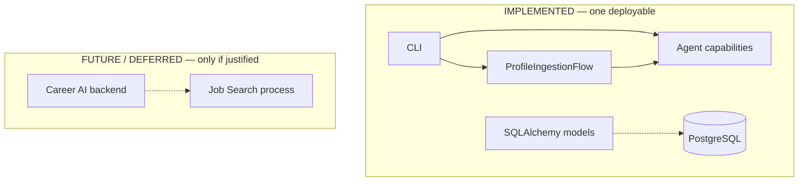
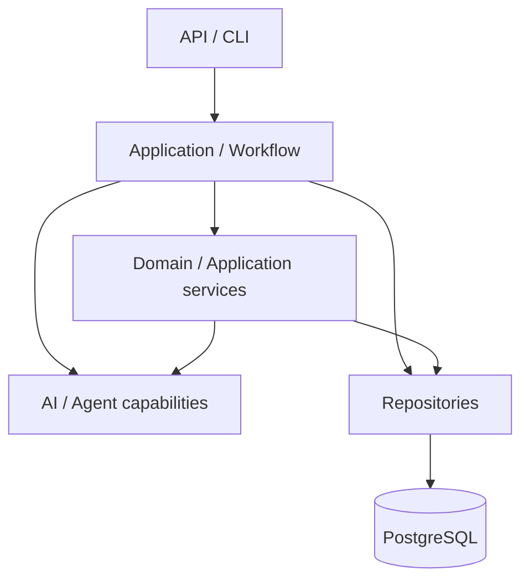
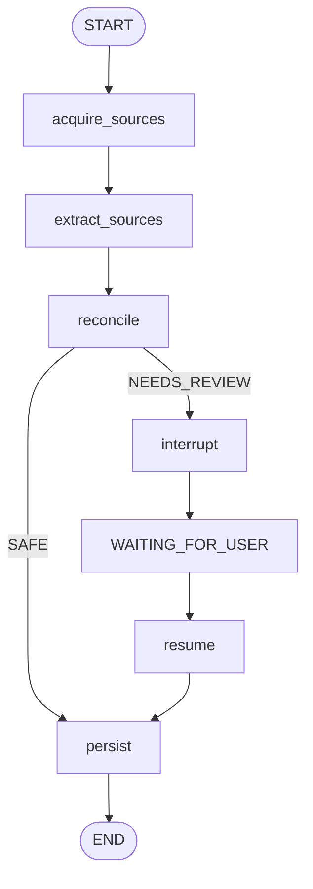
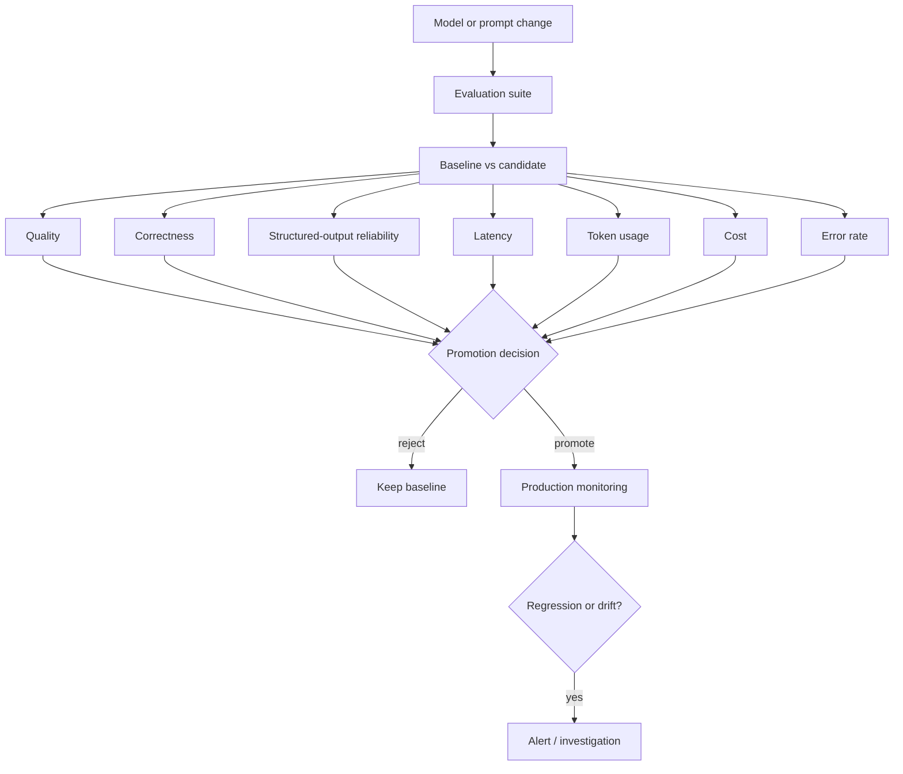

# Future architecture

This page is the long-horizon engineering reference for Career AI: principles that should survive the next features, and infrastructure that should wait until a real use case needs it.

It does not replace the current-system pages. Field lists, CLI flags, schema columns, and the Job Search pipeline stay where they already live.

| If you need… | Read |
|--------------|------|
| What the codebase does today | [Architecture overview](overview.md) |
| Canonical tables and ownership | [Data architecture](data.md) |
| Catalog-first discovery and matching | [Job Search](job-search.md) |
| Ingestion contracts and date rules | [Profile ingestion](../design/profile-ingestion.md) |
| Provider adapter details | [LLM client](../design/llm-client.md) |
| The text extraction path | [Profile ingestion flow](../flows/profile-ingestion.md) |
| Why the monolith and workflow ownership were chosen | [ADR 002](../adr/002-modular-monolith.md), [ADR 003](../adr/003-application-owns-workflows.md) |

## Status labels

| Label | Meaning |
|-------|---------|
| **IMPLEMENTED** | Present in this repository and reachable from the current CLI, schema, or tests. |
| **DECIDED / PLANNED** | Working agreement. The behavior is specified. The code does not do it yet. |
| **FUTURE / DEFERRED** | Direction worth preserving. Do not build it until a concrete use case requires it. Not a current dependency. |

A principle can be decided while its platform stays deferred. Prompt versioning is a decided principle. A prompt registry is deferred.

## Product context

**DECIDED / PLANNED** as product direction. **IMPLEMENTED** only in the slices named below.

Career AI is a personal career assistant. The product direction is a set of capabilities on one candidate's career data:

| Capability | Status |
|------------|--------|
| Profile ingestion | **IMPLEMENTED** for text sources. File and URL acquisition, reconciliation, and canonical writes are **DECIDED / PLANNED**. |
| Candidate profile analysis | **IMPLEMENTED** as a CLI that scores an already-structured `ProfileInput`. See [Profile Analyzer](../design/profile-agent.md). |
| LinkedIn / profile optimization | **DECIDED / PLANNED** product capability. `app/agents/linkedin/` is a placeholder. |
| Job discovery and job matching | **DECIDED / PLANNED**. Schema rows exist for `Job`, `JobSearchRequest`, and `JobMatch`. No search or matching runtime. See [Job Search](job-search.md). |
| CV tailoring | **DECIDED / PLANNED**. `ResumeVersion` is in the schema. `app/agents/resume/` is a placeholder. |
| Ongoing job-search workflows | **DECIDED / PLANNED** as product behavior. No durable workflow runtime. |

The deployable shape is a **modular monolith**: one Python application and one PostgreSQL database. That is **IMPLEMENTED**. Microservices are not the current architecture. See [ADR 002](../adr/002-modular-monolith.md).

Logical module boundaries should stay clean enough that a high-load capability can later move to its own process. **Job Search / Job Platform** is the strongest future extraction candidate because discovery is expected to be I/O-heavy, multi-source, concurrent, rate-limited, asynchronous, and a larger workload than profile CRUD. Extraction of that module is **FUTURE / DEFERRED**. Until then, discovery and matching stay in-process and remain separate responsibilities. Do not describe them as a deployed service.



The HTTP API scaffold (`app/api/`) is empty. Queues, workers, and a second database are absent.

## Agents are capabilities

**DECIDED.** [ADR 003](../adr/003-application-owns-workflows.md). **IMPLEMENTED** only as far as the CLI and `ProfileIngestionFlow` sequence work without owning canonical state.

Agents are capabilities. They are not the owners of the system workflow.

The shape to avoid:

```text
API → Agent → Database
```

The shape to build toward:

```text
API / CLI
        |
        v
Application / Workflow
        |
        +--> Domain / Application services
        |
        +--> AI / Agent capabilities
        |
        +--> Repositories
        |
        v
PostgreSQL
```



The deterministic application layer owns:

- sequencing
- authorization
- persistence decisions
- transaction boundaries
- retries and status transitions
- workflow state
- orchestration

An AI capability may extract, classify, reason, rank, or propose. It does not become the authority for canonical application state.

What exists today is narrower than that diagram:

| Path | What actually runs |
|------|--------------------|
| `analyze-profile` | The CLI calls `ProfileAnalyzerAgent` directly. The agent calls `StructuredLLMClient`. Nothing is persisted. |
| `extract-profile` | The CLI selects a provider, injects it into `ProfileExtractionAgent`, and calls `ProfileIngestionFlow`. The flow normalizes sources and extracts each text source. Nothing is persisted. |

There is no repository, no application service that writes `CandidateProfile`, and no authorization check. `app/workflows/` is ordinary Python. Its package docstring states that these modules are not a workflow engine.

[ADR 003](../adr/003-application-owns-workflows.md) still says Profile Ingestion introduces the first application service and repository. That repository is not in the tree. The ingestion slice that shipped is text extraction. Canonical persistence remains the milestone described in the [architecture overview](overview.md#next-implementation-milestone).

## Profile ingestion

**IMPLEMENTED** for text. Acquisition, reconciliation, and canonical writes are **DECIDED / PLANNED**.

Contracts and date rules: [Profile ingestion](../design/profile-ingestion.md). Runtime sequence: [Profile ingestion flow](../flows/profile-ingestion.md).

```text
ProfileIngestionRequest
        |
        v
ProfileSource[]
        |
        v
Normalization
        |
        v
Per-source profile extraction
        |
        v
ExtractedProfileSource[]
        |
        v
ProfileExtractionResult
```

Four objects must stay distinct:

| Concept | What it is | Status |
|---------|------------|--------|
| `ProfileIngestionRequest` | Raw caller input: one or more `ProfileSource` values. No `user_id`. | **IMPLEMENTED** |
| `NormalizedProfileSource` (`ProfileExtractionInput`) | Content prepared for extraction: `source_type` and text. | **IMPLEMENTED** for text. Same model for both names. |
| `ExtractedCandidateProfile` | Facts extracted from **one** source. Wrapped, with `source_type`, as `ExtractedProfileSource`. | **IMPLEMENTED**. Not persisted. |
| `CandidateProfile` | Canonical professional state for one user in PostgreSQL. | **IMPLEMENTED** as an ORM model. Not written by ingestion. |

`ProfileExtractionResult` is the list of per-source extractions. It is not a canonical profile, and the flow does not merge it.

`ProfileSource.kind` is how the material arrives. `source_type` is what it means.

| `kind` | Payload | Execution |
|--------|---------|-----------|
| `text` | `content` | **IMPLEMENTED.** Normalized, then extracted. |
| `file` | `path` | **IMPLEMENTED** on the contract. The file is not opened. Normalization raises `UnsupportedProfileSourceError` before any model call. |
| `url` | `url` | **IMPLEMENTED** on the contract. The URL is not fetched. Same error, before any model call. |

A request that mixes text with a file or URL fails as a whole. Earlier text sources in that request are not extracted.

`source_type` values that exist today: `cv`, `linkedin`, `portfolio`, `user_text`, `other`.

Formats still ahead, on top of the file and URL kinds:

- CV PDF
- LinkedIn PDF or export
- LinkedIn URL
- portfolio URL
- portfolio or project documents
- user-written text (already executable when supplied as `kind=text`)
- several of those in one request (the list contract already allows this; only text runs)

Parsing those formats is **DECIDED / PLANNED** acquisition work. It is not a new agent and not a new canonical model.

## Per-source extraction

**IMPLEMENTED** in `ProfileIngestionFlow` and `ProfileExtractionAgent`.

Extraction runs once per normalized source. The flow does not concatenate a CV, a LinkedIn export, and a portfolio into one prompt and ask the model for canonical truth.

```text
CV        -> extracted facts
LinkedIn  -> extracted facts
Portfolio -> extracted facts
User text -> extracted facts
```

Each prompt contains one source. `source_type` on the result is copied by the application. The model is not asked to echo it.

That split keeps:

- provenance (which source asserted which fact)
- the possibility of conflict detection
- source-specific reasoning
- a later reconciliation step
- a result that can be debugged source by source

The model extracts what that source says. It does not decide what `CandidateProfile` should contain. `ProfileExtractionAgent` has no loop, no merge, and no database session.

## Canonical merge rule

**DECIDED / PLANNED.** Not implemented. No ingestion path writes `CandidateProfile`.

Canonical updates use **merge, and no implicit deletion**.

Absence of a fact in a newly supplied source is not evidence that the existing canonical fact should be removed.

A CV tailored to one job may omit older experience, unrelated skills, or technologies on purpose. Those omissions must not erase valid `CandidateProfile` rows. Deletion or replacement needs an explicit action, or a future source-aware reconciliation decision. Silence from the new source leaves the canonical value in place.

The same rule is recorded in [Data architecture](data.md#cv-and-linkedin-ingestion) and [Profile ingestion](../design/profile-ingestion.md#reconciliation-and-canonical-merge).

## Reconciliation

**DECIDED / PLANNED.** There is no reconciliation module.

After per-source extraction, a later step compares extracted facts with each other and with the existing canonical profile:

```text
Extracted source facts
        +
Existing canonical state
        |
        v
Reconciliation
        |
        +--> SAFE_MERGE
        |
        +--> NEEDS_REVIEW
        |
        +--> INVALID / INSUFFICIENT
```

Reconciliation should start **hybrid**: deterministic logic wherever the rule is obvious, and model reasoning only where the relationship is ambiguous.

Deterministic example:

| Existing skills | New source | Result |
|-----------------|------------|--------|
| React, TypeScript | React, Python | Python is an additive candidate. TypeScript stays. The new source never mentioned it. |

Ambiguous example:

| Canonical | Extracted from a new source |
|-----------|------------------------------|
| Amdocs, Senior Software Engineer, 2020–2026 | Amdocs, Python & AI Engineer, 2023–2026 |

Possible readings include a role change, a second concurrent role, a promotion, tailored wording, or an extraction mistake. A model may **propose** one of those readings. The proposal does not become canonical truth by itself.

`INVALID / INSUFFICIENT` covers input that should not be merged: empty extraction, a schema-valid result that contradicts itself, or material that is not a professional profile. The exact checks are not specified yet. Decide them with the reconciliation implementation.

## Human in the loop

**DECIDED / PLANNED.** No review records, review API, or conflict tables exist. The schema test explicitly rejects a `workflow_states` table until one is designed.

Meaningful conflicts, and ambiguous changes to canonical user data, require a person.

Example:

| Source of the title | Value |
|---------------------|--------|
| Canonical `current_title` | Senior Frontend Engineer |
| CV extraction | Senior Software Engineer |
| LinkedIn extraction | AI Engineer |

The system must not silently pick one. It should record a reviewable conflict and let the user resolve it.

The model may extract facts and propose a resolution. The user remains the authority for meaningful ambiguous or conflicting changes to canonical profile data.

Human review is not required for every trivial addition. A new skill that no canonical skill contradicts can be a `SAFE_MERGE`. A title that disagrees with the canonical title is `NEEDS_REVIEW`. The policy has to tell those apart. That policy is not code yet.

Downstream capabilities should not treat an unresolved critical field as verified truth. That rule is already in [Data architecture](data.md#conflicting-data-and-human-in-the-loop).

## Resumable workflows

**DECIDED / PLANNED** as a consequence of human review. The runtime is **FUTURE / DEFERRED** until a real review step exists.

Human review breaks the assumption that a workflow finishes inside one process call. A run can reach `NEEDS_REVIEW` and then wait minutes, hours, or days.

So:

```text
HTTP request lifetime  ≠  workflow lifetime
```

The system will need durable workflow state that can pause, checkpoint, sit in `WAITING_FOR_USER`, accept a user decision, and resume. None of that exists. Text extraction finishes inside one CLI process and prints JSON.

Two stores stay separate:

| Store | Examples | Today |
|-------|----------|--------|
| Canonical state | `CandidateProfile`, `Experience`, skills | ORM models exist. Ingestion does not write them. |
| Workflow state | current step, extracted facts awaiting review, pending conflicts, review status, the user's resolution | Not modeled. `workflow_states` is intentionally unmapped. |

Extracted facts waiting for review are workflow state. They become canonical state only after the application applies an approved merge. Putting pending conflicts onto `CandidateProfile` would make an unfinished review look like the user's professional record.

## LangGraph

**FUTURE / DEFERRED** candidate. Not a dependency. `pyproject.toml` does not list it. `app/workflows/__init__.py` states that LangGraph is not used.

The architectural requirement is a resumable, stateful workflow. LangGraph is a leading candidate because later flows may combine model calls, deterministic steps, branches, human interrupts, and checkpoints. It is not a selected engine.

A possible future ingestion graph:



If a graph library is introduced, nodes call reusable application and domain functions: `normalize_profile_sources`, `ProfileExtractionAgent`, and a future reconciliation function. The graph does not become the business logic. Removing the library later should leave those functions callable from a CLI, a test, or another orchestrator.

Do not add LangGraph in order to redraw the current text-extraction loop. That loop is a `for` over sources.

## LLM provider abstraction

**IMPLEMENTED.**

`ProfileExtractionAgent` and `ProfileAnalyzerAgent` depend on `StructuredLLMClient` in `app/tools/llm.py`. The protocol method is `complete_structured(system_prompt, user_prompt, response_model, model=None)`. Provider SDK types do not appear in agent or domain contracts. `app/agents/profile/extraction.py` does not import `cursor_sdk` or `CursorStructuredLLMClient`. `app/tools/__init__.py` does not import the Cursor adapter, so the OpenAI and mock paths do not load `cursor_sdk`.

```text
ProfileExtractionAgent
        |
        v
StructuredLLMClient
        |
        +--> MockStructuredLLM
        |
        +--> StructuredLLM          (OpenAI)
        |
        +--> CursorStructuredLLMClient
```

| Provider | Class | Who selects it |
|----------|-------|----------------|
| Mock | `MockStructuredLLM` | Tests, and `extract-profile --mock` / `--provider mock`. Returns a fixed `ExtractedCandidateProfile` or `ProfileAnalysis`. No network. |
| OpenAI | `StructuredLLM` | Default for `extract-profile`. The only provider `analyze-profile` constructs (`ProfileAnalyzerAgent()` with no injected client). Uses `AsyncOpenAI.responses.parse` and `output_parsed`. |
| Cursor | `CursorStructuredLLMClient` | `extract-profile --provider cursor` only. `analyze-profile` rejects a provider flag. |

The CLI injects the client. The extraction agent does not branch on provider. If `llm` is omitted, the agent constructs `StructuredLLM`, which is the OpenAI default, not a router.

`complete_structured` accepts an optional `model`. Neither agent passes one. Each adapter falls back to Settings: `OPENAI_MODEL` (default `gpt-4o-mini`) or `CURSOR_MODEL` (default `composer-2.5`). Analysis and OpenAI extraction therefore share one model setting. That is centralized configuration. It is not task-based routing.

Adapter behavior that the protocol hides:

| Provider | How a Pydantic object is produced |
|----------|------------------------------------|
| OpenAI | The API enforces the schema via `responses.parse`. An empty `output_parsed` raises `RuntimeError`. |
| Cursor | The adapter puts JSON Schema in the prompt, reads assistant text, parses JSON, then validates with Pydantic. |
| Mock | Returns a pre-built model. Unknown schemas raise `TypeError`. |

Details, including Cursor tool options: [LLM client](../design/llm-client.md).

## Cursor SDK integration

**IMPLEMENTED** for text extraction. Optional.

The package is the official Python SDK `cursor-sdk`, imported as `cursor_sdk`. Locked and installed version: **1.0.32** (`pyproject.toml` requires `cursor-sdk>=1.0.32`; `uv.lock` pins `1.0.32`). There is no TypeScript bridge in this application.

`cursor-sdk` is an agent SDK. Profile extraction needs model inference, not a coding agent. The adapter is built for that narrower use.

| Property | Current behavior |
|----------|------------------|
| API | Async. `AsyncClient.launch_bridge`, then `AsyncAgent.prompt`. |
| Bridge lifetime | One bridge per CLI execution. `extract-profile` opens `CursorStructuredLLMClient` as an async context manager and closes it when the command finishes. |
| Prompt lifetime | Each `complete_structured` is an independent one-shot `AsyncAgent.prompt` (create, wait, dispose). Two sources do not share a conversation. |
| Result | Final assistant text from `RunResult.result`. A status other than `finished` raises `CursorRunError` and is not parsed. |
| Runtime | Local agent. `tools=[]` is local-only, so this path does not use a cloud agent. |
| Workspace | Empty temporary directory (`career-ai-cursor-`). Not the Career AI repository. |
| Tools | Empty allowlist. No built-in shell, edit, read, or web tools. |
| MCP, custom tools, subagents | Unset. |
| Auth | `CURSOR_API_KEY` via Settings, passed as `api_key`. `launch_bridge` sets `allow_api_key_env_fallback=False`. The key is not logged. |
| Model | `CURSOR_MODEL`, default `composer-2.5`. Not chosen by a live `models.list()` call. |

Startup failures log the model, and for `CursorAgentError` the code, `is_retryable`, and `request_id`. The adapter does not retry.

## Structured output safety

**IMPLEMENTED** for the Cursor adapter. OpenAI structured output is a different mechanism, already enforced by `responses.parse`.

Cursor does not offer the Pydantic `text_format` path that OpenAI does. The boundary is:

```text
Pydantic output model
        |
        v
JSON Schema included in the prompt
        |
        v
Cursor agent
        |
        v
final assistant text
        |
        v
JSON parsing
        |
        v
Pydantic validation
        |
        v
trusted structured application object
```

The prompt tells the model to return one JSON value and not to wrap it in markdown. The parser still does not trust that instruction.

`json_text_from_cursor_response` then `parse_cursor_structured_output`:

| Reply | Result |
|-------|--------|
| Raw JSON | Parsed with `json.loads`, then `response_model.model_validate`. |
| One markdown fence around the entire reply, language empty or `json` | Fence stripped, then the same parse and validate. |
| Prose, including prose that contains JSON | `CursorStructuredOutputError`. |
| A fence whose language is neither empty nor `json` | `CursorStructuredOutputError`. |
| Extra fences, or a fence that does not wrap the whole reply | `CursorStructuredOutputError`. |
| Invalid JSON | `CursorStructuredOutputError`. |
| JSON that does not match the schema, including unknown fields (`extra="forbid"`) | `ValidationError` from Pydantic. Not coerced. |

Empty model text is rejected before parsing. Schema failures are logged with the schema name and re-raised. The agent receives only a validated model instance.

## Model routing

**FUTURE / DEFERRED.** Do not add a `ModelRouter` until more than one task actually needs a different model policy.

Principle, for when that happens: an agent defines the **task** it is performing. It does not select the provider or the concrete model.

```text
Task
  |
  v
Model policy / router
  |
  v
Provider adapter
  |
  v
Concrete model
```

A useful task taxonomy, once those capabilities exist:

| Task | What it needs | Likely policy shape |
|------|----------------|---------------------|
| `PROFILE_EXTRACTION` | Reliable structured facts from one source | Fast, structured-output-reliable model |
| `PROFILE_RECONCILIATION` | Ambiguous comparisons against canonical state | Stronger reasoning, used sparingly |
| `JOB_MATCHING` | Ranking after deterministic filters | Cheap or non-model filtering first; a stronger model only for the shortlist |
| `CV_TAILORING` | Faithful rewriting for one job | Reasoning and writing quality |
| `PROFILE_ANALYSIS` | Assessment of an already-structured profile | The current analyzer's job; still shares `OPENAI_MODEL` with extraction |

Today both live model calls that go through OpenAI use the same `OPENAI_MODEL`. Cursor is a provider switch on extraction, not a per-task policy. Keep it that way until a second task has a measured reason to differ.

## Provider and model

**IMPLEMENTED:** the CLI chooses a provider for extraction, and Settings holds one model id per provider.

**FUTURE / DEFERRED:** choosing provider and model per task.

Provider and model are different axes.

| Axis | Examples in this repo | What it is |
|------|----------------------|------------|
| Provider | `openai`, `cursor`, `mock` | Which adapter implements `StructuredLLMClient` |
| Model | `gpt-4o-mini`, `composer-2.5` | Which model id that provider runs |

A later policy can change either axis without an agent edit:

```text
PROFILE_EXTRACTION
    provider = cursor
    model    = <fast model id>

PROFILE_RECONCILIATION
    provider = cursor
    model    = <reasoning model id>

CV_TAILORING
    provider = openai
    model    = <writing model id>
```

Those assignments are illustrations, not selected models. No task table exists in Settings.

## Model version management

**IMPLEMENTED** in a limited form: model id strings live in Settings (`openai_model`, `cursor_model`) and in `.env.example`. Agents do not embed `gpt-4o-mini` or `composer-2.5`.

**DECIDED / PLANNED** as the longer rule: keep identifiers in one policy, not in agent modules.

Distinguish a logical policy from a physical model:

| Logical policy | Physical binding |
|----------------|------------------|
| `profile_extraction_default` | `provider = cursor`, `model = <concrete id>` |

Changing the physical id should not require an agent change. The id that actually ran should eventually be observable. See [AI execution metadata](#ai-execution-metadata).

There is no logical-policy name in code today. `OPENAI_MODEL` is a single physical default shared by every OpenAI call.

## Prompt versioning

**DECIDED** as a principle. **FUTURE / DEFERRED** as a registry. Current prompts are unversioned constants.

Model identity does not reproduce a result. Behavior depends on:

- provider and model identifier
- prompt version
- model configuration (temperature and related settings, once any exist)
- input
- application / code version

Extraction instructions live in `PROFILE_EXTRACTION_SYSTEM_PROMPT` and `build_profile_extraction_user_prompt` (`app/prompts/profile_extraction.py`). Analyzer instructions live in `app/prompts/profile.py`. Neither name carries a version.

When prompts start to change under evaluation, give them explicit logical versions, for example `profile-extraction-v1` and `profile-extraction-v2`. A prompt change is a behavioral change. It should be comparable to a model change, not treated as a comment edit.

Do not build a prompt registry, database of templates, or feature-flagged prompt loader until more than one version needs to be executed or compared. The [Prompts](../design/prompts.md) page already notes versioning as a later improvement for the analyzer text.

## AI execution metadata

**FUTURE / DEFERRED** as a stored record. **IMPLEMENTED** logging is only what the adapters print.

For an important model call, we should eventually be able to answer:

- which task ran
- which provider produced the result
- which model, and the exact model identifier
- which prompt version
- which configuration
- when, and how long it took
- token or other resource usage, and estimated cost
- whether structured validation succeeded
- whether a retry or a fallback was required
- which application version ran

Conceptual fields:

| Field | Why it matters |
|-------|----------------|
| `task` | Extraction vs reconciliation vs tailoring |
| `provider`, `model`, model identifier | Reproduce the binding |
| `prompt_version` | Separate a wording change from a model change |
| timestamp, latency | Operations and the cost/latency trade-off |
| input/output usage, estimated cost | Budget |
| validation result | Structured-output reliability |
| retry count, fallback provider/model | Whether the result is from the primary policy |
| application version | Tie the run to code |

Do not add a table for this yet. The information requirement comes first. Current logs include the selected model name, the schema name, and, for Cursor, run id and status. They do not record latency, tokens, cost, prompt version, or a durable validation outcome. Secrets stay out of logs; the Cursor adapter already avoids logging the API key.

## Fallbacks

**FUTURE / DEFERRED.** No retry loop and no second provider exist. Cursor logs `is_retryable` and then raises.

A later policy might look like:

```text
PROFILE_EXTRACTION
        |
   primary provider / model
        |
   invalid structured result or timeout
        |
   retry policy
        |
   still failing
        |
   fallback provider / model
```

Changing provider or model can change what "a skill" or "a current role" means in the output. A fallback is a semantic change, not only a reliability trick. Introduce one only with an explicit policy: which errors qualify, how many retries, which fallback binding, and a rule that the fallback is written into execution metadata. A silent fallback makes later evaluation unauditable.

## Evaluation

**FUTURE / DEFERRED** as a platform. **DECIDED** as the question the platform has to answer.

The question is: did this model or prompt change actually improve Career AI? A few hand-picked examples are not an answer.



Unit tests already lock contracts: schema rejection, per-source sequencing, unsupported file/URL handling, and Cursor text parsing against scripted replies. Those tests do not score extraction quality against a labeled corpus, and they do not call a live model. They are the regression net for code. They are not an evaluation suite.

Build the suite when there is enough real task behavior and labeled data to make a comparison mean something.

### Golden datasets

**FUTURE / DEFERRED.** No labeled extraction corpus is in the repo. `examples/` holds sample CLI payloads, not expected-output benchmarks.

Each important task should eventually have representative inputs and expected properties. For profile extraction, a case is a realistic source plus expectations such as:

- the title the source actually states
- the experiences and skills it states
- no employer the source does not mention
- a schema-valid `ExtractedCandidateProfile`

The set should cover normal profiles and the cases that break naive extraction:

- incomplete profiles
- conflicting wording inside one source
- a CV tailored to one job
- more than one role at the same company
- missing dates and ambiguous dates
- multilingual input, where the product supports it
- portfolio and project descriptions
- adversarial or malformed input

The same dataset version then compares bindings:

- model A + `profile-extraction-v1`
- model B + `profile-extraction-v1`
- model B + `profile-extraction-v2`

### Task-specific metrics

**DECIDED** as a rule. **FUTURE / DEFERRED** as measured numbers.

There is no single "LLM quality score". Each capability has its own failures.

| Task | Metrics that match the failure |
|------|--------------------------------|
| Profile extraction | Schema validity, field precision and recall, invented employers or skills, experience correctness, skill correctness, date correctness, unsupported inference |
| Job matching | Ranking relevance, precision@K, recall@K where labels exist, whether the user accepts the match, whether the explanation matches the job and the profile |
| CV tailoring | Factual consistency, preservation of candidate truth, relevance to the job, unsupported claims, human preference |
| Reconciliation | Conflict-detection recall, false conflicts, unsafe automatic merges, whether `NEEDS_REVIEW` cases were the ones a person needed to see |

### Deterministic evaluators

**DECIDED.** Prefer code when code can decide.

Schema validation, required fields, exact expected values, allowed values, unknown-field rejection, and comparison against facts present in the supplied source are deterministic. Hallucinated employers are often checkable by seeing whether the name occurs in the source text.

Do not call a second model to score a metric that a validator or a string comparison already answers. The Cursor adapter's Pydantic check is the kind of gate an evaluator should keep using offline.

### LLM-as-a-judge

**FUTURE / DEFERRED**, and non-authoritative when it exists.

A judge model can help with semantic quality, explanation quality, relevance, writing quality, and ambiguous extraction. It also inherits judge bias, preference for models like itself, run-to-run instability, and prompt sensitivity.

Use it beside deterministic metrics, golden labels, and human review. Do not promote a model on a judge score alone.

### Human evaluation

**FUTURE / DEFERRED.**

Some outputs have to be read by a person: tailored CV quality, profile recommendations, reconciliation proposals, and whether a job match is actually relevant. Important releases should have a small curated review set.

Human feedback can later become evaluation data. Everyday product behavior (a click, a dismissal) is a signal, not automatic ground truth. People skip, mis-click, and accept drafts they did not fully check.

### Baseline versus candidate

**DECIDED** as the shape of an experiment. **FUTURE / DEFERRED** as a platform. Do not build an experiment service now.

A meaningful model or prompt change is an experiment against a baseline:

| Part | Contents |
|------|----------|
| Experiment | task, dataset version |
| Baseline | provider, model, prompt version, configuration |
| Candidate | provider, model, prompt version, configuration |
| Results | quality metrics, latency, cost, failure rate |
| Decision | promoted, rejected, or needs review |

The record is what makes the change reproducible. "It looked better on one CV" is not an experiment.

### Promotion gates

**DECIDED** as a trade-off. Exact thresholds are **FUTURE / DEFERRED** and must be per task.

Higher quality on one metric is not automatically a better production configuration.

A candidate that gains 2% extraction quality, costs 300% more, and takes 250% longer may be the wrong default for high-volume extraction and a reasonable choice for rare reconciliation. Promotion policy can require, for a given task:

- hallucination rate does not increase
- schema validity is at least the baseline
- quality gain clears a stated threshold
- latency stays under a stated budget
- cost stays inside a stated budget

Write the thresholds down when the first real comparison happens. Do not invent global numbers in advance.

### Shadow, canary, and A/B

**FUTURE / DEFERRED.** Offline datasets miss live source formats and live user behavior. Online evaluation waits until there is production traffic worth splitting.

| Strategy | What happens | When it fits |
|----------|----------------|--------------|
| Shadow | The user sees the current model. The candidate runs on a copy. Its output is measured and not shown. | A new extraction or matching prompt, before any user-visible change. |
| Canary | A small share of real traffic gets the candidate, and the user sees that result. | The offline comparison passed, and a limited blast radius is enough to watch failures. |
| A/B | Users are split across versions when the product outcome can be compared. | Matching or tailoring, where acceptance or edits are a meaningful signal. Poor fit for a single-user local CLI. |

Shadow is the safest first online step because a bad candidate cannot write canonical state or reach the user.

### Production observability

**FUTURE / DEFERRED.** Offline evaluation does not see the next week's inputs.

Once real traffic exists, track per task and per version:

- request count
- latency
- failure rate
- schema validation failures
- retries
- fallback frequency
- token or resource usage
- cost
- human-review escalation rate
- user corrections
- acceptance or rejection, where the product has that signal

Those series are how a golden set's blind spots show up. Nothing in the current CLI aggregates them.

### Regression and drift

**DECIDED** as two different events. Detection machinery is **FUTURE / DEFERRED**.

| Event | Cause | How it should be caught |
|-------|--------|-------------------------|
| Regression | A deliberate model, prompt, or code change made a metric worse. | Baseline vs candidate, before promotion. |
| Drift | The same configuration behaves worse because inputs, job-market language, provider behavior, user behavior, or source formats moved. | Production metrics against a historical baseline, with no deploy required to trigger a look. |

Example: profile-extraction schema failures at 0.5% historically and 7% this week. That deserves investigation even though nobody shipped a change. A golden set frozen last quarter will not, by itself, explain a new LinkedIn export layout.

### Traceability

**FUTURE / DEFERRED.** Depends on prompt versions, execution metadata, and experiment records. None of those stores exist.

Two questions the records should answer:

1. This extraction was produced by which task, provider, model, prompt version, application version, and time?
2. Why did prompt `profile-extraction-v2` become `profile-extraction-v3`? The answer should be an experiment result, not an unrecorded impression.

Canonical `CandidateProfile` rows do not store that provenance today, and they should not be overloaded to store it casually. Link or attach execution metadata when persistence of extractions is actually designed.

## Cost, latency, and quality

**DECIDED** as the selection trade-off. No budget numbers are set.

Model choice optimizes three competing dimensions at once: quality, cost, and latency. The strongest model is not the default for every task.

| Situation | What dominates |
|-----------|----------------|
| High-volume extraction of ordinary sources | Cost and latency, with a hard floor on schema validity and hallucinations |
| A rare, ambiguous reconciliation | Reasoning quality can justify a slower, more expensive model |
| First-pass job filtering | Deterministic filters, or a cheap model, before any expensive ranking call |

This is why task policy stays outside the agent. The extraction agent should keep calling "extract this source" while the policy decides whether that call is the fast model or the careful one.

## Current, next, and future

Derived from the repository, not from a target diagram.

### Currently implemented

| Item | Where |
|------|--------|
| Modular monolith: one application, one PostgreSQL database, no workers or service split | `app/`, `app/db/`, Alembic |
| `StructuredLLMClient` protocol | `app/tools/llm.py` |
| OpenAI `StructuredLLM` (`responses.parse`) | `app/tools/llm.py` |
| `MockStructuredLLM` | `app/tools/mock_llm.py` |
| `CursorStructuredLLMClient` on `cursor-sdk` 1.0.32 | `app/tools/cursor_llm.py` |
| `ProfileExtractionAgent` | `app/agents/profile/extraction.py` |
| `ProfileAnalyzerAgent` | `app/agents/profile/agent.py` |
| `ProfileIngestionRequest` with text, file, and URL kinds | `app/models/profile_ingestion.py` |
| Text normalization and per-source extraction | `app/workflows/profile_ingestion.py` |
| Pydantic validation of extraction output, including the Cursor JSON boundary | `app/tools/cursor_llm.py`, ingestion models |
| Unversioned extraction and analyzer prompts | `app/prompts/` |
| Provider choice on `extract-profile` (`mock`, `openai`, `cursor`); OpenAI-only `analyze-profile` | `app/cli.py` |
| Model ids in Settings (`OPENAI_MODEL`, `CURSOR_MODEL`) | `app/config.py` |
| PostgreSQL schema for users, canonical profile, catalog, matches, resume versions | `app/db/models/` |
| Contract and adapter tests that do not call live model APIs | `tests/` |

File and URL sources are representable and then rejected. The schema is not written by either CLI. Placeholder packages (`linkedin`, `resume`, `jobs`) and `app/api/` contain no behavior.

### Next / planned

These are specified and still unbuilt. They are the ingestion path's continuation, not a platform program.

| Item | Notes |
|------|--------|
| File acquisition and parsing | Contract exists. Execution stops with `UnsupportedProfileSourceError`. |
| URL acquisition | Same. |
| Reconciliation (`SAFE_MERGE`, `NEEDS_REVIEW`, `INVALID / INSUFFICIENT`) | Hybrid. Model output stays a proposal. |
| Human review for meaningful conflicts | Not for every additive skill. |
| Canonical merge into `CandidateProfile` with no implicit deletion | First application-owned write. Repository still absent. |
| Separation of canonical rows from workflow/review state | Design the tables with that feature, not before. |

Job Search's own planned entities (`SearchExecution`, async execution, catalog-first discovery) are specified in [Job Search](job-search.md) and [ADR 004](../adr/004-catalog-first-job-search.md). They are not part of the ingestion milestone.

### Future / only when justified

| Item | Why it waits |
|------|----------------|
| Resumable orchestration, with LangGraph as a candidate | Wait until a workflow actually pauses for a user. |
| `ModelRouter` and per-task provider/model policy | Wait until two tasks need different bindings. |
| Prompt registry | Wait until two prompt versions must be run or compared. |
| Execution-metadata storage | Wait until a caller needs to audit a real run. |
| Retries and fallbacks | Wait for a written policy. A fallback changes semantics. |
| Evaluation suite, golden datasets, experiment records | Wait for labeled data and a change worth comparing. |
| Shadow, canary, A/B | Wait for traffic where a split is meaningful. |
| Drift monitoring | Wait for a historical production baseline. |
| Job Search as a separate process | Wait until independent scaling is justified. [ADR 002](../adr/002-modular-monolith.md). |
| HTTP API | Empty scaffold. Call application services when it appears, not agents. |

## Build when justified

Design the boundary early. Implement the infrastructure when a real use case requires it.

The provider protocol exists now, because two real backends and a test double already share it. A model router waits until extraction, reconciliation, and tailoring truly need different policies.

Human review implies runs that outlive one request. LangGraph, or any other engine, waits until the states to interrupt and resume are concrete. The current extraction loop does not need a graph.

Evaluation requirements are recorded now so the first prompt change is treated as a behavior change. An evaluation platform waits until there is behavior and a dataset worth scoring.

Module boundaries are drawn so Job Search could move later. The running system stays one process and one database until a separate deployment earns its cost.
