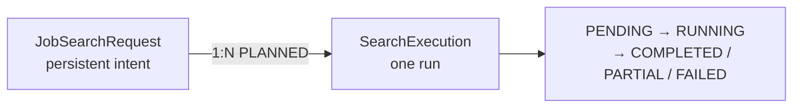
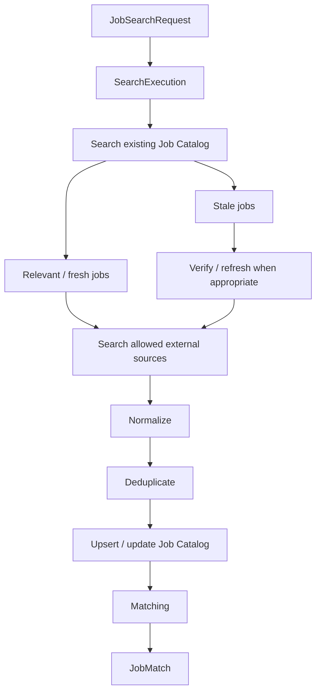
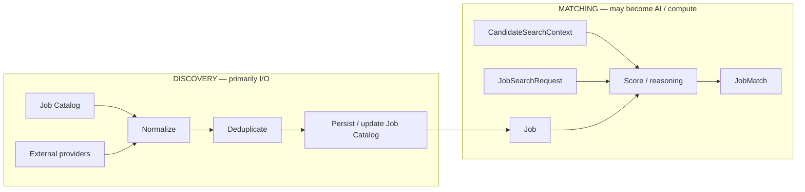
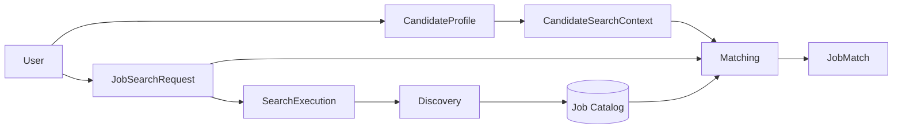

# Job Search

This page is **planned architecture** for Job Search. The current codebase has `Job`, `JobSearchRequest`, and `JobMatch` tables, and an empty `app/agents/jobs/` placeholder. There is no search engine, no `SearchExecution` persistence, no catalog refresh, and no matching runtime.

Status labels follow [Architecture overview](overview.md). Related persistence: [Data architecture](data.md). Decision: [ADR 004](../adr/004-catalog-first-job-search.md).

## Why Job Search is different

**Decided.** Job discovery is the strongest likely future extraction candidate because it is expected to become I/O-heavy: multiple external sources, rate limits, timeouts, retries, concurrent source execution, catalog refresh, normalization, deduplication, and potentially high concurrency.

Until independent deployment is justified, Discovery and Matching run inside the modular monolith. They remain **separate responsibilities** and should not be assumed to become the same future microservice.

Profile CRUD is not the same workload and is not the first extraction candidate.

## JobSearchRequest vs SearchExecution

**Decided.** `SearchExecution` is **not** in the current schema.

| Concept | Meaning | Persistence today |
|---------|---------|-------------------|
| `JobSearchRequest` | Persistent **search intent**: what this user wants to search for | Implemented (`candidate_profile_id`, title, location, experience range) |
| `SearchExecution` | One concrete **attempt/run** of that request | Planned |



Relationship: `JobSearchRequest` 1:N `SearchExecution`.

This supports asynchronous execution, refreshes/reruns, search history, incremental searching, failure tracking, and future multi-source execution.

Previous executions may optimize later ones, for example:

- when the search last ran
- what may need refreshing
- avoiding treating every run as a first search
- future provider-specific incremental mechanisms (cursors are **deferred**)

Do **not** design `SourceExecution` persistence yet.

## Catalog-first pipeline

**Decided** as the search pipeline. **Not implemented.**

The internal Job Catalog always participates **before** external discovery. External discovery enriches and refreshes the catalog. It must not create a separate temporary universe of jobs outside the catalog.



Matching consumes catalog `Job` rows plus candidate/search context. It does not persist matches against uncatalogued provider payloads.

## Discovery vs Matching

**Decided.** Keep these separate even if they first execute in the same backend.



Do not assume Discovery and Matching must become the same future microservice.

Contracts should be transport-friendly. `CandidateSearchContext` / `SearchExecutionRequest` may be in-process Python objects today and later cross an API or message boundary. Do not pass SQLAlchemy ORM objects as that contract.

## External source policy

**Decided** conceptually. **Do not add source-policy database columns yet.** Persistence is decided during Job Search flow design.

The user may eventually restrict which **external** job sources are used.

| Mode | Behavior |
|------|----------|
| **AUTO** (default) | Internal Job Catalog always participates. The system selects default, available, and permitted external sources. |
| **SELECTED** | Internal Job Catalog always participates. Only explicitly selected external providers are queried. |

"No external source selected" must **not** mean "search nowhere." The catalog still participates.

Default behavior is **AUTO**.

Avoid ambiguous contracts around omitted vs empty source arrays. An omitted list and an empty list must not silently mean different things, or empty must be defined as AUTO rather than "search nothing."

## Asynchronous search

**Decided** as the execution model for heavy Job Search. **Not implemented.** Queue/broker technology is **deferred**.

Creating or starting a search remains a **short synchronous** operation:

```text
request
  → validate
    → create/read JobSearchRequest
      → create SearchExecution
        → enqueue / start asynchronous work
          → return search / execution identifier and status
```

Future source discovery can execute concurrently.

A single external provider failure should not necessarily fail the whole search.

Example:

```text
Provider A → completed
Provider B → timeout
Provider C → completed
SearchExecution → PARTIAL
```

## JobMatch and executions

**Implemented today:** uniqueness of one `JobMatch` per (`JobSearchRequest`, `Job`).

**Planned:** preserve which execution first discovered that match (`discovered_in_execution` / `first_matched_execution`). Exact field name is chosen before the migration.

Repeated executions must not create duplicate `JobMatch` rows merely because the same job was rediscovered.

Do not introduce full N:M history between `JobMatch` and `SearchExecution` now.

## Job freshness vs execution time

**Decided** as a separation of concerns. Freshness columns are **deferred**.

- `SearchExecution` answers: when did this search run / when was this match discovered?
- Job freshness answers: when did we last verify that this job is still relevant/active?

`status = ACTIVE` does not mean the listing was verified today.

Before important actions (tailored CV, application workflow, other time-sensitive work), the application should be able to verify **that one Job** if freshness is insufficient, without rerunning the entire search.

See [Job catalog and freshness](data.md#job-catalog-and-freshness).

## Authenticated personalized search vs anonymous catalog search

**Authenticated personalized search** is the product path (not implemented beyond schema):



**Anonymous / public catalog search** is a **supported future extension only**. Do not implement it now.

It must be able to operate against the global Job Catalog **without** requiring `User`, `CandidateProfile`, persisted `JobSearchRequest`, or personalized `JobMatch`:


Preserve this extension in the architecture: do not make every catalog read require a `User` or a persisted search request. Personalized ranking and `JobMatch` remain authenticated.

## Intentionally deferred for this flow

Decide these when implementing Job Search, not in Profile Ingestion:

- `SourceExecution` persistence
- queue / broker technology
- worker topology
- polling vs SSE vs WebSocket for status
- retry / backoff strategy
- provider-specific cursors
- Job deduplication algorithm
- exact freshness TTL and DB fields
- source-policy persistence model
- N:M JobMatch / SearchExecution history
- Matching parallelism / batching
- extracting Job Search as a service
- service-to-service authentication
