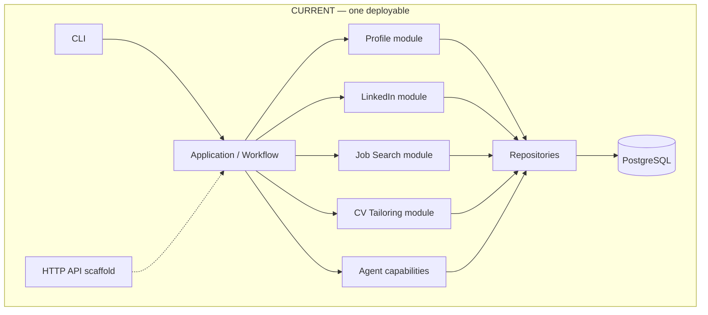
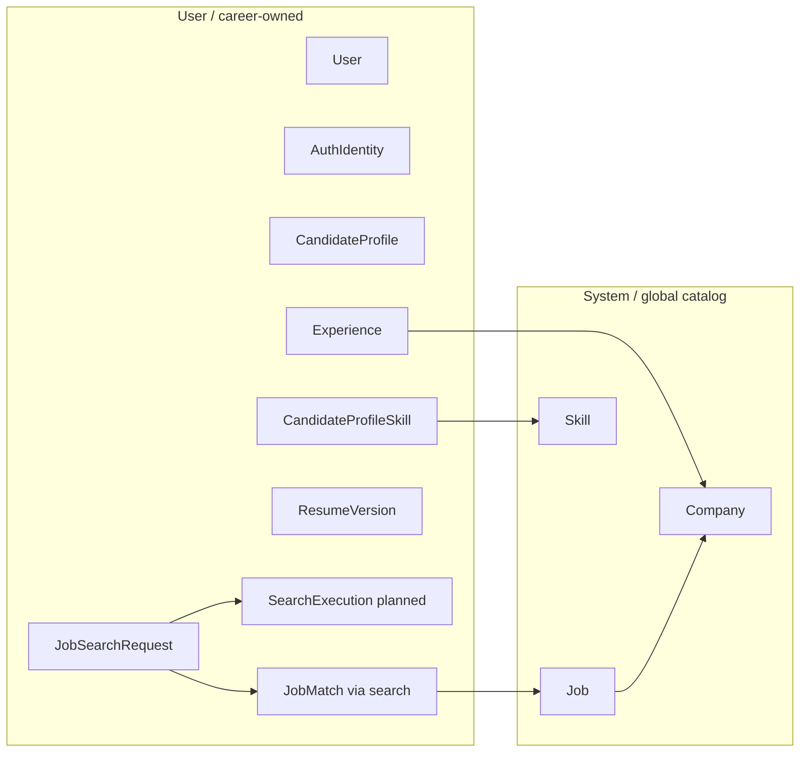
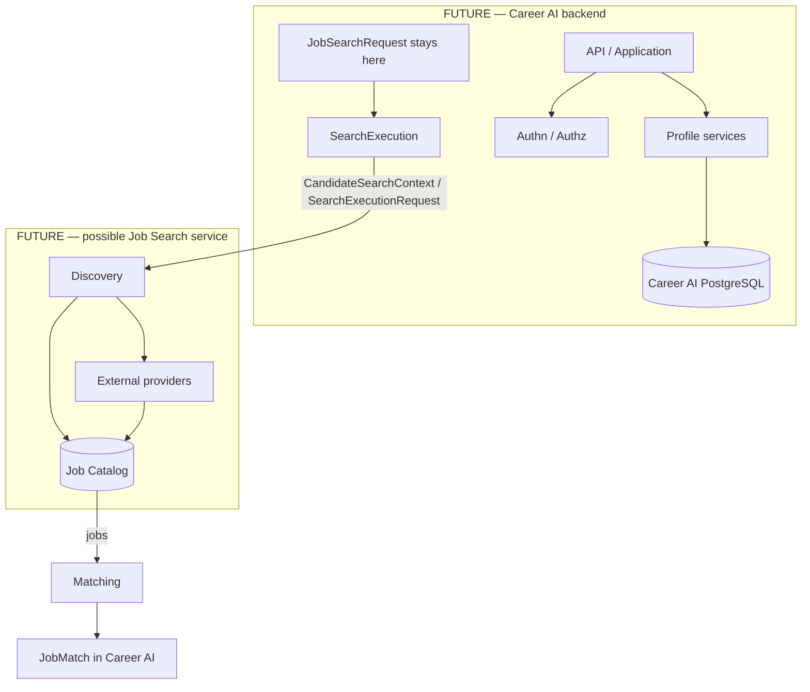
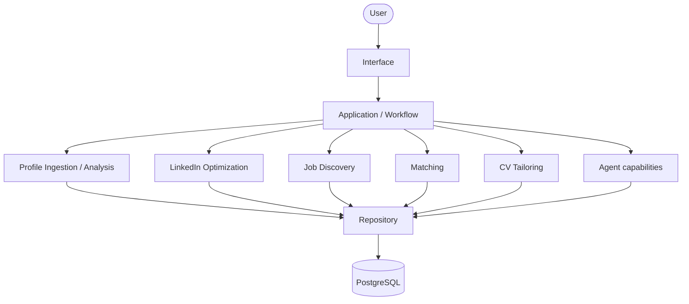
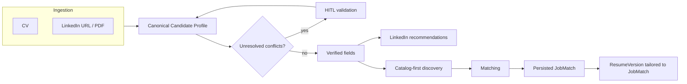
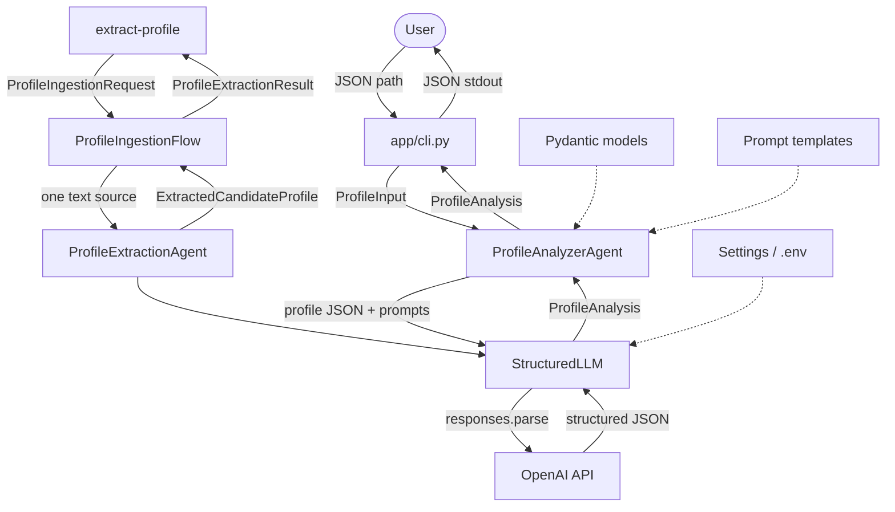
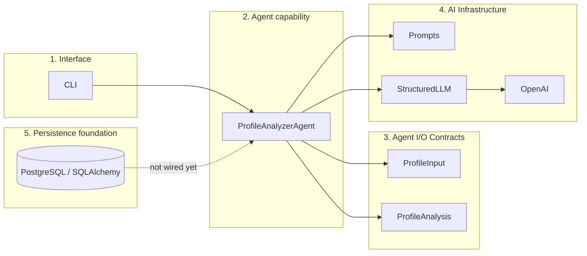
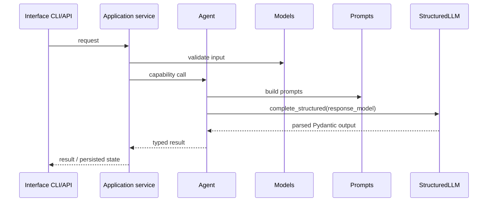

# Architecture

Career AI helps a user **manage and optimize the job-search process**.

This page distinguishes:

- **Implemented** — what the current codebase does
- **Decided** — product or design choices that are current working agreements
- **Proposed** — target architecture not yet built
- **Open question** — unresolved
- **Future consideration** — identified, not in scope yet

Career AI is a **modular monolith**. It is not a microservice system today, and documentation must not describe the current deployable as if it were.

Related pages:

- [Data architecture](data.md) — persistence, ownership, schema
- [Job Search](job-search.md) — catalog-first discovery, `SearchExecution`, matching
- [Project structure](project-structure.md) — package layout
- [ADR 002](../adr/002-modular-monolith.md) · [ADR 003](../adr/003-application-owns-workflows.md)

## Product goal

**Decided** as product direction. **Not fully implemented.**

The product ingests a candidate's professional sources, builds a reliable profile, and uses that profile across job-search workflows.

### Initial inputs

| Input | Notes |
|-------|--------|
| CV file | Source document for career history |
| LinkedIn profile information | Structured or extracted profile data |
| LinkedIn identity | Full profile URL **or** LinkedIn vanity/username |
| LinkedIn profile PDF | Expected for **complete** profile ingestion; a URL alone cannot be assumed to yield all required fields |

**Implemented:** text sources on a `ProfileIngestionRequest` are normalized and extracted per source. The result is not persisted and is not the canonical profile. File and URL sources are part of the input contract, but acquisition is not implemented. Canonical persistence, reconciliation, and human review remain later. See [Profile ingestion](../design/profile-ingestion.md) and [Next implementation milestone](#next-implementation-milestone).

### Capabilities

| Capability | Product status | Implementation today |
|------------|----------------|----------------------|
| Candidate / profile analysis | MVP | Partial: CLI analyzes a pre-structured `ProfileInput` JSON file. |
| Text profile extraction | MVP slice | **Implemented:** CLI extracts text sources to per-source JSON. No file/URL acquisition, reconciliation, or persistence. |
| Canonical profile persistence | MVP | Schema exists; extraction does not write `CandidateProfile`. |
| LinkedIn optimization recommendations | MVP | Not implemented (`app/agents/linkedin/` is a placeholder) |
| Job discovery (catalog + external sources) | MVP | Not implemented (`app/agents/jobs/` is a placeholder) |
| Candidate-to-job matching / ranking | MVP | Not implemented |
| CV tailoring for a selected job | MVP | Not implemented (`app/agents/resume/` is a placeholder) |
| Persistent job-search context across sessions | MVP | Partial: PostgreSQL schema exists; agents/CLI do not persist yet |

Discovery and matching stay **separate responsibilities** even when they first execute inside the same backend. See [Job Search](job-search.md).

### Out of current product MVP

Leftover scaffold folders from an earlier layout (`coach`, `content`, `skills`, `memory`) are **not** part of the current product MVP and are not in the tree.

**Future considerations** (not MVP): HTTP API (`app/api/` is an empty scaffold), vector/semantic retrieval, career-coach / content / learning agents, anonymous Job Catalog browsing.

## Modular monolith (current)

**Decided** as the current architecture. **Implemented** as one deployable backend and one PostgreSQL database.

Principle:

> Design boundaries as if modules may become services; deploy as a monolith until independent deployment is justified.

Today that means:

- one Python application
- one PostgreSQL database (SQLAlchemy + Alembic)
- logical module boundaries inside that application
- no queues, workers, or independently deployed services



Application services, repositories, and Job Search runtime paths in that diagram are **decided**, not implemented. What exists today is the CLI, the Profile Analyzer, the text extraction flow, ORM models, and Alembic migrations against one database.

### Module ownership

Logical ownership is independent of process topology.

**User / career-side state** (Career AI user domain):

- `User`
- `AuthIdentity`
- `CandidateProfile`
- `Experience`
- `CandidateProfileSkill`
- `ResumeVersion`
- `JobSearchRequest`
- `SearchExecution` (**planned** entity)
- `JobMatch` access/ownership through its `JobSearchRequest`

**System / global catalog:**

- `Job`
- `Company`
- `Skill`

`JobSearchRequest` is **user-owned search intent**: what this user wants to search for (title, location, experience range, other criteria). It is not a run of the search engine. Search history must remain Career AI user state even if the Job Search implementation is later replaced or extracted.

`Company` is shared by `Experience` and `Job`. Future service ownership of `Company` is an **open question**. Do not redesign it now.



Details and the implemented schema: [Data architecture](data.md).

## Planned Job Search extraction

**Proposed.** Do not describe this as the running system.

The strongest likely future extraction candidate is **Job Search / Job Platform**. Job discovery is expected to become a heavy workload:

- multiple external sources
- network I/O
- provider rate limits
- timeouts and retries
- concurrent source execution
- catalog refresh
- normalization and deduplication
- potentially high concurrency

Profile management and ordinary CRUD have different characteristics and are not the first extraction candidate.



Until extraction is justified, Discovery and Matching still run **in-process** in the monolith. They remain separate responsibilities and should not be assumed to become the **same** future service. Transport-friendly contracts (`CandidateSearchContext` / `SearchExecutionRequest`) may start as in-process Python objects.

See [Job Search](job-search.md) and [ADR 002](../adr/002-modular-monolith.md).

## Agents and workflow ownership

**Decided.** [ADR 003](../adr/003-application-owns-workflows.md).

Agents are **capabilities**, not owners of application workflows.

Avoid:

```text
API → Agent → direct DB access
```

Prefer:

```text
API / CLI
  → Application / Workflow
    → Domain / Application Service
      → Agent capability when needed
        → Repository
          → PostgreSQL
```

The deterministic application layer owns sequencing, persistence, transactions, authorization, retries/status handling, and orchestration.

Agents use explicit input/output contracts (Pydantic). Do not pass SQLAlchemy ORM objects across module boundaries where a stable contract should exist.

The implemented Profile Analyzer is a capability invoked by the CLI. It does not persist. Text extraction is a second capability: the CLI calls `ProfileIngestionFlow`, which calls `ProfileExtractionAgent` once per text source. That flow does not persist and does not introduce a repository.

## Authentication and authorization

**Decided** as a rule. Authentication and authorization flows are **not implemented**.

| Concern | Question | Example |
|---------|----------|---------|
| Authentication | Who is the actor? | `AuthIdentity` → `User` |
| Authorization | What may this actor access or do? | User-owned `CandidateProfile` only in that user's context |

Rules:

- User-owned resources are only accessed or mutated in an **authenticated actor context**.
- Application services enforce ownership before user-owned operations.
- Repositories are data-access abstractions. They are not the sole authorization layer.
- Do **not** build a full RBAC system now.
- Future service actors and workers are not human `User` rows. Do not model background work as if it were a person.

## Target product components (proposed)

**Proposed.** This is product-component direction inside the monolith. It is not a mesh of microservices.



`app/workflows/profile_ingestion.py` is a deterministic Python flow for text extraction. It is not a workflow engine. Repositories do not exist yet.

### Conceptual components

#### Profile Ingestion / Analysis

Responsible for:

- ingesting CV and LinkedIn information (later)
- parsing those sources
- normalizing them into structured candidate data
- detecting conflicting information
- producing a reliable **Candidate Profile**

The implemented [Profile Analyzer Agent](../design/profile-agent.md) is a **narrow capability**: it scores an already-structured JSON profile. It does not ingest sources.

The implemented [text extraction flow](../design/profile-ingestion.md) turns text sources into per-source facts. It does not read files, fetch URLs, persist a canonical profile, or run human-in-the-loop conflict resolution.

Canonical persistence, file and URL acquisition, and reconciliation are still later.

#### LinkedIn Optimization

Responsible for:

- analyzing the structured candidate profile and LinkedIn state
- producing improvement recommendations
- maintaining context about previous recommendations and actions

#### Job Discovery

Responsible for searching and refreshing the **Job Catalog**, including the internal catalog first and then allowed external sources. External discovery enriches the catalog; it does not create a separate temporary job universe.

#### Matching

Responsible for scoring a `CandidateSearchContext` + `JobSearchRequest` + `Job` into a persisted `JobMatch` when relevance passes the configured threshold.

Discovery is primarily I/O-heavy. Matching may become AI/compute-heavy. They must stay distinguishable even if first shipped in one process.

#### CV Tailoring

Responsible for:

- using a `JobMatch` and the Candidate Profile
- generating a resume tailored to that specific opportunity (`ResumeVersion` with `version_type=tailored`)

Before time-sensitive actions such as tailoring a CV or starting an application, the application should be able to verify **that individual job's freshness** without rerunning the entire search. See [Job freshness](data.md#job-catalog-and-freshness).

#### Application / Workflow

Coordinates sequence and data. Downstream components should consume **structured candidate information**, not raw CV/LinkedIn blobs on every call. See [Data architecture](data.md).

### Conceptual workflow



Authenticated personalized search uses `User` + `CandidateProfile` + `JobSearchRequest` + `SearchExecution` → Matching → `JobMatch`. Anonymous catalog browsing is a [supported future extension](job-search.md#authenticated-personalized-search-vs-anonymous-catalog-search) only.

## Implemented architecture (current codebase)

**Implemented:** profile analysis, text profile extraction, and an unused PostgreSQL schema.

| Component | Status | Key files |
|-----------|--------|-----------|
| Profile Analyzer I/O contracts | Done | `app/models/profile.py` |
| Profile Analyzer Agent | Done | `app/agents/profile/agent.py` |
| Profile ingestion / extraction contracts | Done | `app/models/profile_ingestion.py` |
| Profile Extraction Agent | Done | `app/agents/profile/extraction.py` |
| Text ingestion flow | Done | `app/workflows/profile_ingestion.py` |
| OpenAI Structured Outputs | Done | `app/tools/llm.py` |
| Cursor SDK provider (optional) | Done | `app/tools/cursor_llm.py` |
| Prompt templates | Done | `app/prompts/profile.py`, `app/prompts/profile_extraction.py` |
| Settings from `.env` | Done | `app/config.py` |
| PostgreSQL persistence foundation | Done | `app/db/`, `alembic/` |
| CLI | Done | `app/cli.py` |
| Tests | Done | `tests/` |
| Repositories / canonical profile writes | Missing | Later |
| File and URL acquisition | Missing | Request contract only |
| Reconciliation / HITL | Missing | Later |
| FastAPI | Empty | `app/api/` |
| Other agents | Placeholders | `linkedin`, `resume`, `jobs` |

The Profile Analyzer defines a typed **analysis** contract (`ProfileInput` → `ProfileAnalysis`). That contract is not the persisted Candidate Profile and is not the ingestion payload. Text ingestion is a separate contract (`ProfileIngestionRequest` → per-source `ExtractedCandidateProfile`). The repeatable agent pattern is **Pydantic Input → Prompt → LLM Structured Output → Pydantic Output**. OpenAI enforces that schema in the API. The optional Cursor provider is an agent SDK: the adapter asks for JSON text and validates it with Pydantic. `ProfileExtractionAgent` depends only on `StructuredLLMClient`. The application flow owns sequencing. Persistence and reconciliation are not part of either agent.

### Implemented pipeline



### Responsibility layers

**Implemented today** for the Profile Analyzer. Text extraction adds a flow in front of its agent: CLI → `ProfileIngestionFlow` → `ProfileExtractionAgent`. Neither path persists.



**Decided target layering** (not implemented except the persistence foundation):

| Layer | Question it answers | Allowed dependencies |
|-------|---------------------|----------------------|
| Interface | How do we invoke it? | Application / Workflow |
| Application / Workflow | What is the business sequence? | Domain services, contracts |
| Domain / Application Service | What is the use case? | Repositories, agent capabilities, contracts |
| Agent capability | What AI/specialized work is needed? | Typed I/O, prompts, tools — not ORM |
| Repository | How is domain state stored and loaded? | SQLAlchemy models, session |
| Persistence | PostgreSQL | One database for the monolith |

## Design principles already in use

### 1. Typed contracts before the LLM

Input and output are Pydantic models.
The LLM does not return free-form text — it returns a structure that is validated.

### 2. Thin agents, thicker tools

`ProfileAnalyzerAgent` does not know OpenAI HTTP details.
It only builds prompts and calls `StructuredLLM`.

### 3. Dependency injection for tests

You can pass a mock `llm=` into the agent:

```python
ProfileAnalyzerAgent(llm=MockStructuredLLM())
```

Tests then need no real network calls.

### 4. Central config

All runtime settings (model, API key, log level, database URL) go through `Settings`.

## Repeatable pattern for future agents

Every new agent should look like this:

```text
app/agents/<name>/
  agent.py          # Agent class
  __init__.py       # Public export

app/models/<name>.py     # Input/Output models
app/prompts/<name>.py    # system/user prompts
tests/test_<name>_agent.py
```

Shared flow (capability only — the application layer owns persistence):



Placeholder package names (`linkedin`, `resume`, `jobs`) may be renamed or split when components are implemented. Do not treat folder names as a frozen component map.

## Current vs planned

| Area | Status |
|------|--------|
| Modular monolith, one PostgreSQL, one backend | **Implemented** as deployable shape |
| Profile Analyzer CLI | **Implemented** |
| Text profile extraction CLI | **Implemented** (no persistence) |
| SQLAlchemy models + Alembic initial schema | **Implemented** |
| Supabase as hosted PostgreSQL for development | **Implemented** (hosting, not an app API) |
| Architecture / development documentation | **Implemented** |
| Tests for analyzer, text extraction, and ORM metadata | **Implemented** |
| File/URL acquisition, reconciliation, canonical profile writes | **Planned** |
| `SearchExecution` persistence | **Planned** |
| Async Job Search, queue/workers | **Planned**; queue technology **deferred** |
| Multi-source external discovery | **Planned** |
| External source selection policy | **Decided** conceptually; persistence **deferred** |
| Catalog refresh / freshness workflow | **Decided** conceptually; schema **deferred** |
| Job Search microservice | **Future consideration** |
| Partial `SearchExecution` handling | **Planned** with Job Search |
| Anonymous Job Catalog search | **Future consideration** |
| Service-to-service authorization | **Future consideration** |

Do not describe planned components as currently implemented.

## Next implementation milestone

**Text extraction is implemented.** Canonical persistence is not.

Implemented path:

```text
ProfileIngestionRequest
  → normalize text sources
    → ProfileExtractionAgent (one source at a time)
      → ProfileExtractionResult
```

`ProfileExtractionResult` is not written to PostgreSQL. File and URL sources fail before extraction. Reconciliation and human review are not implemented.

Still ahead for a canonical profile: an application-owned merge into `CandidateProfile` that does not treat a missing fact as a deletion, plus repositories. That work is not this slice. Do not implement queues, workers, microservices, or Job Search in it.

## Intentionally deferred decisions

These are **not** solved. Decide them when the relevant flow is implemented:

- `SourceExecution` persistence
- queue / broker technology
- worker topology
- Redis / cache architecture
- polling vs SSE vs WebSocket
- retry / backoff strategy
- provider-specific cursors
- Job deduplication algorithm
- exact Job freshness TTL
- exact freshness DB fields
- N:M `JobMatch` / `SearchExecution` history
- Matching parallelism / batching
- microservice database split
- service-to-service authentication mechanism
- observability stack

## Scale and performance

**Future consideration**, except that **Job Search execution is expected to be asynchronous** ([Job Search](job-search.md#asynchronous-search)). Creating a search stays a short synchronous operation; heavy work is enqueued later. Do not choose a queue or broker now.

Other techniques discussed, not selected: caching, extra indexing, batching, read replicas.

No cache, queue, or replica infrastructure is in the project today.

## What is still missing architecturally

| Gap | Status |
|-----|--------|
| Canonical profile merge + repository | Not started |
| Text extraction flow (`app/workflows/profile_ingestion.py`) | **Implemented**; not a workflow engine |
| Profile ingestion from CV / LinkedIn PDF or URL | Request contract only; acquisition not implemented |
| Canonical Candidate Profile persistence wiring | Schema implemented; not wired |
| `SearchExecution`, async Job Search, catalog-first pipeline | Proposed; see [Job Search](job-search.md) |
| LinkedIn optimization, CV tailoring | Proposed product MVP; placeholders only |
| HTTP API (`app/api/`) | Future consideration |
