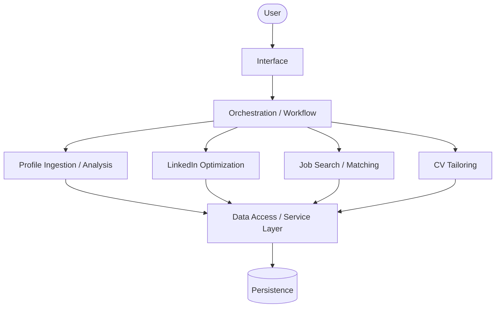
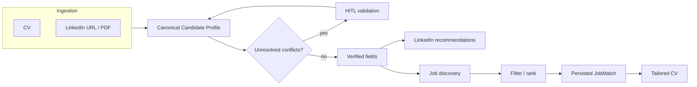
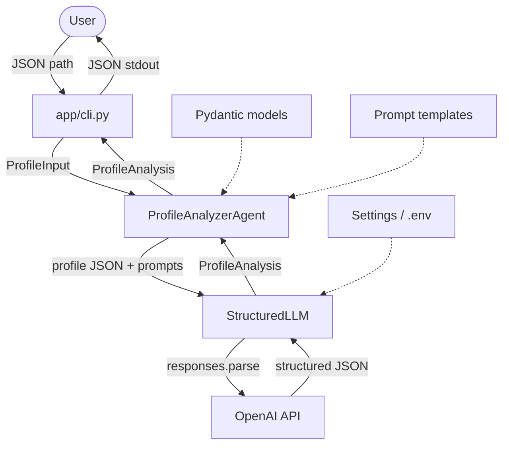
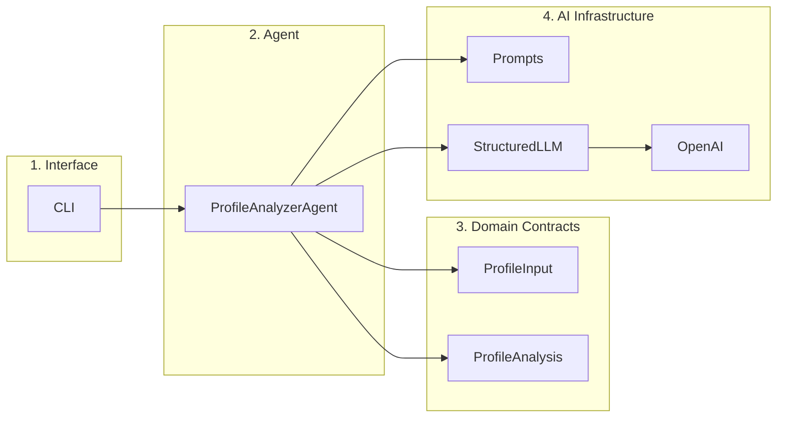
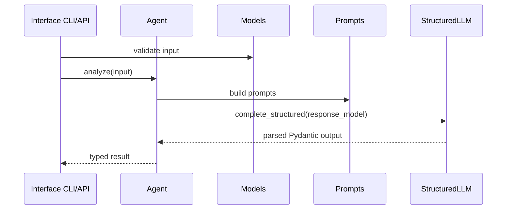

# Architecture

Career AI helps a user **manage and optimize the job-search process**.

This page distinguishes:

- **Implemented** — what the current codebase does
- **Decided** — product or design choices that are current working agreements
- **Proposed** — target architecture not yet built
- **Open question** — unresolved
- **Future consideration** — identified, not in scope yet

Persistence, ingestion, conflicts, and the conceptual data model are in [Data architecture](data.md). Package layout is in [Project structure](project-structure.md).

## Product goal

**Decided** as product direction. **Not fully implemented.**

The product ingests a candidate's professional sources, builds a reliable profile, and uses that profile across job-search workflows.

### Initial inputs

| Input | Notes |
|-------|--------|
| CV file | Source document for career history |
| LinkedIn profile information | Structured or extracted profile data |
| LinkedIn identity | Full profile URL **or** LinkedIn vanity/username |
| LinkedIn profile PDF | Expected for **complete** profile ingestion; a URL alone cannot be assumed to yield all required fields |

### Capabilities

| Capability | Product status | Implementation today |
|------------|----------------|----------------------|
| Candidate / profile analysis | MVP | Partial: CLI analyzes a pre-structured `ProfileInput` JSON file. No CV or LinkedIn ingestion. |
| LinkedIn optimization recommendations | MVP | Not implemented (`app/agents/linkedin/` is a placeholder) |
| Job discovery | MVP | Not implemented (`app/agents/jobs/` is a placeholder) |
| Candidate-to-job matching / ranking | MVP | Not implemented |
| CV tailoring for a selected job | MVP | Not implemented (`app/agents/resume/` is a placeholder) |
| Persistent job-search context across sessions | MVP | Not implemented; no user/profile persistence |

Job discovery and matching stay **conceptually distinct** even if the first implementation lives in one component.

### Out of current product MVP

The repository still has placeholder folders for `coach`, `content`, and `skills`, plus empty `memory/` (earlier notes mentioned RAG). Those are **not** part of the current product MVP. They remain scaffold only unless a later decision revives them.

**Future considerations** (not MVP): HTTP API, vector/semantic retrieval, career-coach / content / learning agents.

## Target architecture (proposed)

**Proposed.** This is the current system-design direction. It is not the running system.

The target is a **multi-agent architecture with separation of concerns**, coordinated by an orchestration layer. Agents are not an uncontrolled mesh: they do not each coordinate directly with every other agent.



Orchestration is the coordinator of **workflow and data passed between components**. It is a high-level design direction; `app/workflows/` exists only as an empty scaffold.

### Conceptual components

#### Profile Ingestion / Analysis

Responsible for:

- ingesting CV and LinkedIn information
- parsing those sources
- normalizing them into structured candidate data
- detecting conflicting information
- producing a reliable **Candidate Profile**

The implemented [Profile Analyzer Agent](../design/profile-agent.md) is a **narrow slice** of this component: it scores an already-structured JSON profile. It does not ingest files, persist a canonical profile, or run human-in-the-loop conflict resolution.

#### LinkedIn Optimization

Responsible for:

- analyzing the structured candidate profile and LinkedIn state
- producing improvement recommendations
- maintaining context about previous recommendations and actions

#### Job Search / Matching

Responsible for:

- searching an **actively maintained job catalog** (system-level inventory, not a per-user scrape-on-demand starting point)
- filtering and ranking jobs using candidate information and user-defined relevance criteria
- creating **persisted matches only** for jobs that pass the configured relevance threshold

Discovery (what is in the catalog / what can be found) and matching (what is relevant enough to persist as a `JobMatch`) remain distinguishable even if first shipped together.

#### CV Tailoring

Responsible for:

- using a `JobMatch` and the Candidate Profile
- generating a CV tailored to that specific opportunity

#### Orchestration / Workflow

Coordinates the sequence of work and the data each component receives. Downstream components should consume **structured candidate information**, not raw CV/LinkedIn blobs on every call. See [Data architecture](data.md).

### Conceptual workflow



## Implemented architecture (current codebase)

**Implemented:** a single typed pipeline from profile JSON to analysis JSON.

| Component | Status | Key files |
|-----------|--------|-----------|
| Pydantic profile models | Done | `app/models/profile.py` |
| Profile Analyzer Agent | Done | `app/agents/profile/agent.py` |
| OpenAI Structured Outputs | Done | `app/tools/llm.py` |
| Prompt templates | Done | `app/prompts/profile.py` |
| Settings from `.env` | Done | `app/config.py` |
| CLI | Done | `app/cli.py` |
| Tests | Done | `tests/` |
| Orchestrator / workflows | Empty | `app/workflows/` |
| Memory | Empty | `app/memory/` |
| FastAPI | Empty | `app/api/` |
| Other agents | Placeholders | `linkedin`, `resume`, `jobs`, `coach`, `content`, `skills` |

The Profile Agent came first because it defines a typed user-data contract for analysis. The repeatable implementation pattern is **Pydantic Input → Prompt → LLM Structured Output → Pydantic Output**. That pattern can remain for new agents; it does not by itself provide persistence, ingestion, or orchestration.

### Implemented pipeline



### Responsibility layers (implemented)



| Layer | Question it answers | Allowed dependencies |
|-------|---------------------|----------------------|
| Interface | How do we invoke it? | Agent + Models |
| Agent | What is the business flow? | Models, Prompts, Tools |
| Domain Contracts | What does the data look like? | Pydantic only |
| AI Infrastructure | How do we talk to the LLM? | OpenAI SDK + Settings |

These layers describe **today's code**. The proposed Data Access / Service Layer (authorization, validation, persistence) is not present yet; see [Data architecture](data.md#data-access-principles).

## Design principles already in use

### 1. Typed contracts before the LLM

Input and output are Pydantic models.  
The LLM does not return free-form text — it returns a structure that is validated.

### 2. Thin agents, thicker tools

`ProfileAnalyzerAgent` does not know OpenAI HTTP details.  
It only builds prompts and calls `StructuredLLM`.

### 3. Dependency injection for tests

You can pass a fake `llm=` into the agent:

```python
ProfileAnalyzerAgent(llm=fake_llm)
```

Tests then need no real network calls.

### 4. Central config

All runtime settings (model, API key, log level) go through `Settings`.

## Repeatable pattern for future agents

Every new agent should look like this:

```text
app/agents/<name>/
  agent.py          # Agent class
  __init__.py       # Public export

app/models/<name>.py     # Input/Output models
app/prompts/<name>.py    # system/user prompts
tests/test_<name>_agent.py
```

Shared flow:



Placeholder package names (`linkedin`, `resume`, `jobs`, …) may be renamed or split when the proposed components are implemented. Do not treat folder names as a frozen component map.

## Scale and performance

**Future consideration.** Recorded so later implementation can address them; do not add caches, queues, or replicas until a concrete need exists.

Potential bottlenecks:

- database read/write load
- concurrent API / workflow execution
- repeated downstream reads of the Candidate Profile
- external job-source and LLM calls

Techniques discussed, not selected:

- caching (Candidate Profile is a likely cache candidate; job data may be cached only with explicit freshness/TTL)
- indexing
- reducing unnecessary reads/writes
- batching where useful
- read replicas at larger scale
- asynchronous processing / queues (to be explored further)

No cache, queue, or replica infrastructure is in the project today. Do not introduce it as a current requirement.

## What is still missing architecturally

| Gap | Status |
|-----|--------|
| Orchestration (`app/workflows/`) | Proposed; scaffold only |
| Profile ingestion from CV / LinkedIn PDF or URL | Proposed; not started |
| Canonical Candidate Profile persistence | Proposed; see [Data architecture](data.md) |
| Data access / service layer | Proposed; not started |
| LinkedIn optimization, job catalog/matching, CV tailoring | Proposed product MVP; placeholders only |
| HTTP API (`app/api/`) | Future consideration |
| Database engine | **Open question** |
