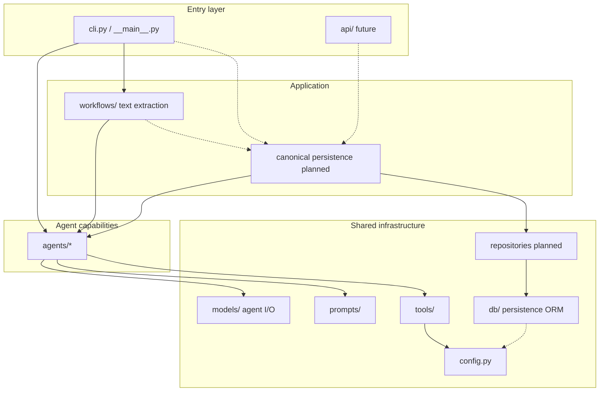

# Project structure

## Directory tree (what exists)

```text
career-ai/
├── app/                         # Application code
│   ├── __init__.py
│   ├── __main__.py              # Enables: python -m app
│   ├── cli.py                   # Terminal entrypoint
│   ├── config.py                # Settings from .env
│   ├── db/                      # SQLAlchemy persistence foundation
│   │   ├── base.py              # Declarative Base + mixins
│   │   ├── session.py           # Lazy engine / sessionmaker
│   │   └── models/              # ORM mappings
│   ├── agents/                  # All agents
│   │   ├── profile/             # Analyzer and extraction agents
│   │   │   ├── __init__.py
│   │   │   ├── agent.py
│   │   │   └── extraction.py
│   │   ├── linkedin/            # Placeholder (proposed MVP)
│   │   ├── resume/              # Placeholder (proposed MVP)
│   │   └── jobs/                # Placeholder (proposed MVP)
│   ├── models/                  # Pydantic I/O contracts
│   │   ├── profile.py           # Profile Analyzer input/output
│   │   └── profile_ingestion.py # Ingestion request and extraction output
│   ├── prompts/                 # Prompt templates
│   │   ├── profile.py           # Analyzer
│   │   └── profile_extraction.py
│   ├── tools/                   # Shared tools (LLM providers)
│   │   ├── llm.py               # OpenAI structured client + protocol
│   │   ├── cursor_llm.py        # Optional Cursor SDK adapter
│   │   └── mock_llm.py          # Deterministic test double
│   ├── workflows/               # Deterministic flows (text extraction; no engine)
│   └── api/                     # Empty scaffold – future HTTP API
├── alembic/                     # Migrations
│   ├── env.py
│   └── versions/
├── tests/                       # Tests
├── examples/                    # Sample inputs
├── docs/                        # MkDocs site – see below
├── scripts/                     # Helpers (git push)
├── alembic.ini
├── mkdocs.yml                   # Docs site navigation
├── pyproject.toml               # Dependencies + tooling config
├── uv.lock                      # Locked dependency versions
├── .env.example                 # Secret template (no real values)
├── .env                         # Local secrets (not in git)
├── .gitignore
└── README.md
```

## Documentation layout

```text
docs/
├── index.md                    # Docs home and folder map
├── architecture/
│   ├── overview.md             # Modular monolith, layers, current vs planned
│   ├── data.md                 # Persistence, ownership, relational schema
│   ├── job-search.md           # Planned catalog-first Job Search
│   └── project-structure.md    # This page
├── design/                     # Implemented feature and component design
├── development/                # Setup, testing, documentation conventions
├── adr/
    ├── 001-postgresql.md
    ├── 002-modular-monolith.md
    ├── 003-application-owns-workflows.md
    └── 004-catalog-first-job-search.md
└── flows/
    └── profile-ingestion.md    # Text extraction path
```

Do not add empty placeholder pages.

Guidelines: [Documentation](../development/documentation.md). Database setup: [Database](../development/database.md).

## Why this layout?



**Implemented today:** CLI → Profile Analyzer, and CLI → `ProfileIngestionFlow` → Profile Extraction agent. Repositories do not exist yet. Canonical profile persistence is still later, not an extra deployable.

### Key principle

- **`agents/`** = capabilities (AI/specialized work), not workflow owners
- **`models/`** = agent and ingestion I/O contracts (not persistence)
- **`prompts/`** = how we talk to the LLM (instructions)
- **`tools/`** = how we connect outward (OpenAI, optional Cursor SDK, mock)
- **`db/`** = how domain state is stored (SQLAlchemy; not used by agents yet)
- **`workflows/`** = deterministic application sequencing (text extraction today)
- **`cli.py` / `api/`** = how the user invokes the system
- **repositories** = planned; they own persistence. Authorization stays in the application layer.

This lets us replace CLI with an API later without rewriting capabilities. The API should call application services, not agents directly. See [ADR 003](../adr/003-application-owns-workflows.md).

## File → responsibility map

| File | Single responsibility |
|------|------------------------|
| `app/config.py` | Load settings and secrets |
| `app/db/` | SQLAlchemy Base, engine/session, ORM models |
| `alembic/` | Schema migrations |
| `app/models/profile.py` | Profile Analyzer I/O contract (`ProfileInput` / `ProfileAnalysis`) |
| `app/models/profile_ingestion.py` | Ingestion request and per-source extraction contracts |
| `app/prompts/profile.py` | Analyzer instruction text |
| `app/prompts/profile_extraction.py` | Extraction instruction text |
| `app/tools/llm.py` | `StructuredLLMClient` protocol and OpenAI structured output |
| `app/tools/cursor_llm.py` | Optional Cursor agent adapter; Pydantic validates the text |
| `app/tools/mock_llm.py` | Deterministic structured LLM for tests and `--mock` |
| `app/agents/profile/agent.py` | Run the analysis capability |
| `app/agents/profile/extraction.py` | Extract facts from one source |
| `app/workflows/profile_ingestion.py` | Normalize sources and extract each text source |
| `app/cli.py` | `analyze-profile` and `extract-profile` |
| `tests/*` | Verify contracts and flow |

## What does "placeholder" mean?

Folders like `app/agents/jobs/` currently contain only a short status docstring in `__init__.py`.

This is intentional: they reserve a place in the package tree without premature implementation.

They are **not** a frozen map of the [modular monolith components](overview.md#target-product-components-proposed). Current product components are Profile Ingestion / Analysis, LinkedIn Optimization, Job Discovery, Matching, CV Tailoring, and Application / Workflow. Discovery and Matching may share a package at first; they stay separate responsibilities. Earlier leftover folders (`coach`, `content`, `skills`, `memory`) were removed so the tree matches that map.

## Root-level project files

| File | Role |
|------|------|
| `pyproject.toml` | Package name, dependencies, `career-ai` script, pytest/ruff config |
| `uv.lock` | Exact versions for reproducible installs |
| `alembic.ini` | Alembic config; database URL comes from Settings, not this file |
| `.env` | Local secrets (`OPENAI_API_KEY`, `CURSOR_API_KEY`, `DATABASE_URL`, `GITHUB_TOKEN`) – **not in git** |
| `.env.example` | Safe shared template |
| `examples/sample_profile.json` | Sample Profile Analyzer input |
| `examples/sample_profile_ingestion.json` | Sample text ingestion request |

## How Python finds the `app` package

In `pyproject.toml`:

```toml
[tool.pytest.ini_options]
pythonpath = ["."]
```

With `uv sync`, the package is installed in editable mode, so imports like:

```python
from app.agents.profile import ProfileAnalyzerAgent
```

work in both tests and the CLI.
