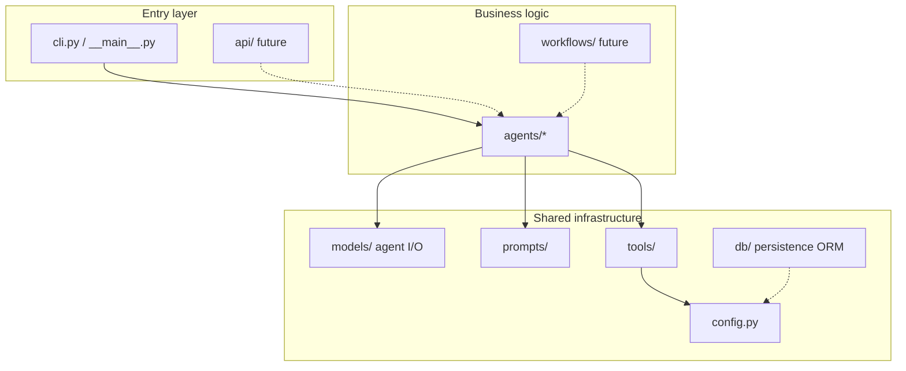

# Project structure

## Directory tree (what exists)

```text
career-ai/
├── app/                         # Application code
│   ├── __init__.py
│   ├── __main__.py              # Enables: python -m app
│   ├── cli.py                   # Terminal entrypoint
│   ├── config.py                # Settings from .env
│   ├── db/                      # SQLAlchemy persistence foundation
│   │   ├── base.py              # Declarative Base + mixins
│   │   ├── session.py           # Lazy engine / sessionmaker
│   │   └── models/              # ORM mappings
│   ├── agents/                  # All agents
│   │   ├── profile/             # Implemented
│   │   │   ├── __init__.py
│   │   │   └── agent.py
│   │   ├── linkedin/            # Placeholder (proposed MVP)
│   │   ├── resume/              # Placeholder (proposed MVP)
│   │   └── jobs/                # Placeholder (proposed MVP)
│   ├── models/                  # Agent I/O contracts (Pydantic)
│   │   └── profile.py           # Profile Analyzer input/output
│   ├── prompts/                 # Prompt templates
│   │   └── profile.py           # Done
│   ├── tools/                   # Shared tools (LLM, etc.)
│   │   └── llm.py               # Done
│   ├── workflows/               # Empty scaffold – proposed orchestration
│   └── api/                     # Empty scaffold – future HTTP API
├── alembic/                     # Migrations
│   ├── env.py
│   └── versions/
├── tests/                       # Tests
├── examples/                    # Sample inputs
├── docs/                        # MkDocs site – see below
├── scripts/                     # Helpers (git push)
├── alembic.ini
├── mkdocs.yml                   # Docs site navigation
├── pyproject.toml               # Dependencies + tooling config
├── uv.lock                      # Locked dependency versions
├── .env.example                 # Secret template (no real values)
├── .env                         # Local secrets (not in git)
├── .gitignore
└── README.md
```

## Documentation layout

```text
docs/
├── index.md                    # Docs home and folder map
├── architecture/
│   ├── overview.md             # Product, target vs implemented architecture
│   ├── data.md                 # Persistence, ingestion, relational schema
│   └── project-structure.md    # This page
├── design/                     # Implemented feature and component design
├── development/                # Setup, testing, documentation conventions
└── adr/
    └── 001-postgresql.md       # PostgreSQL + SQLAlchemy decision
```

`flows/` is created when the first end-to-end flow is written. Do not add empty placeholder pages.

Guidelines: [Documentation](../development/documentation.md). Database setup: [Database](../development/database.md).

## Why this layout?



### Key principle

- **`agents/`** = what the system can do (capabilities)
- **`models/`** = agent input/output contracts (not persistence, not ingestion)
- **`prompts/`** = how we talk to the LLM (instructions)
- **`tools/`** = how we connect outward (OpenAI, etc.)
- **`db/`** = how domain state is stored (SQLAlchemy; not used by agents yet)
- **`cli.py` / `api/`** = how the user invokes the system

This lets us replace CLI with an API later without rewriting the agent.

## File → responsibility map

| File | Single responsibility |
|------|------------------------|
| `app/config.py` | Load settings and secrets |
| `app/db/` | SQLAlchemy Base, engine/session, ORM models |
| `alembic/` | Schema migrations |
| `app/models/profile.py` | Profile Analyzer I/O contract (`ProfileInput` / `ProfileAnalysis`) |
| `app/prompts/profile.py` | LLM instruction text |
| `app/tools/llm.py` | Call OpenAI + parse structured output |
| `app/agents/profile/agent.py` | Run the analysis flow |
| `app/cli.py` | Read JSON file and print result |
| `tests/*` | Verify contracts and flow |

## What does "placeholder" mean?

Folders like `app/agents/jobs/` currently contain only a short status docstring in `__init__.py`.

This is intentional: they reserve a place in the package tree without premature implementation.

They are **not** a frozen map of the [target architecture](overview.md#target-architecture-proposed). Current product components are Profile Ingestion / Analysis, LinkedIn Optimization, Job Search / Matching, CV Tailoring, and Orchestration. Earlier leftover folders (`coach`, `content`, `skills`, `memory`) were removed so the tree matches that map.

## Root-level project files

| File | Role |
|------|------|
| `pyproject.toml` | Package name, dependencies, `career-ai` script, pytest/ruff config |
| `uv.lock` | Exact versions for reproducible installs |
| `alembic.ini` | Alembic config; database URL comes from Settings, not this file |
| `.env` | Local secrets (`OPENAI_API_KEY`, `DATABASE_URL`, `GITHUB_TOKEN`) – **not in git** |
| `.env.example` | Safe shared template |
| `examples/sample_profile.json` | Sample input for CLI runs |

## How Python finds the `app` package

In `pyproject.toml`:

```toml
[tool.pytest.ini_options]
pythonpath = ["."]
```

With `uv sync`, the package is installed in editable mode, so imports like:

```python
from app.agents.profile import ProfileAnalyzerAgent
```

work in both tests and the CLI.
