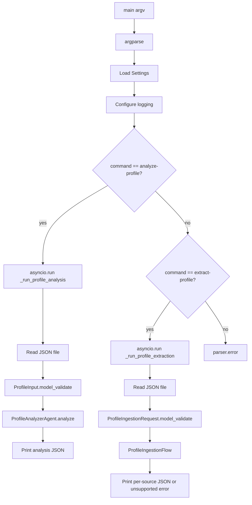

# CLI – terminal interface

## Files

- `app/cli.py` – main implementation
- `app/__main__.py` – enables `python -m app`
- `pyproject.toml` → `[project.scripts] career-ai = "app.cli:main"`

## How to run

Three equivalent forms:

```bash
uv run career-ai analyze-profile examples/sample_profile.json
uv run python -m app analyze-profile examples/sample_profile.json
uv run python -m app.cli analyze-profile examples/sample_profile.json
```

Text extraction (mock LLM, no API key):

```bash
uv run career-ai extract-profile examples/sample_profile_ingestion.json --mock
```

## Current commands

### `analyze-profile`

```bash
career-ai analyze-profile <profile_path>
```

| Argument | Meaning |
|----------|---------|
| `profile_path` | Path to a JSON file matching the Profile Analyzer input contract (`ProfileInput`) |

## CLI flow



## `_run_profile_analysis` step by step

1. Read the JSON file
2. Validate into `ProfileInput` (invalid input raises Pydantic error)
3. Create the agent
4. Run `await agent.analyze(...)`
5. Print `analysis.model_dump_json(indent=2)` to stdout
6. Return exit code `0`

## `extract-profile`

```bash
career-ai extract-profile <request_path> [--mock]
```

| Argument | Meaning |
|----------|---------|
| `request_path` | Path to a JSON file matching `ProfileIngestionRequest` |
| `--mock` | Use `MockStructuredLLM` instead of OpenAI |

The command runs `ProfileIngestionFlow`: normalize sources, extract each text source, print `ProfileExtractionResult` JSON. `--mock` returns the same canned profile for every source and still emits one result per source. Without `--mock`, the command calls OpenAI and needs `OPENAI_API_KEY`.

File and URL sources are valid JSON and exit `1` with `UnsupportedProfileSourceError` on stderr. They are not read or fetched.

Details: [Profile ingestion](profile-ingestion.md).

## Logging

Format:

```text
%(asctime)s | %(levelname)s | %(name)s | %(message)s
```

Log level comes from `LOG_LEVEL` in `.env` (default `INFO`).

During a run you will see logs such as:

- Analyzing profile for ...
- Requesting structured completion ...
- Profile analysis complete ... score=...
- Extracting profile facts from source_type=...

The main result (JSON) is printed separately to stdout.

## Sample file

`examples/sample_profile.json` includes:

- Name, headline, about
- Two roles
- Skills
- Career goal toward AI Engineer

You can copy it and adapt it to your real profile.

`examples/sample_profile_ingestion.json` is a two-source text request for `extract-profile`.

## What the CLI still lacks

- Saving output to a file (`--output`)
- Interactive mode
- Reading a CV file or fetching a LinkedIn or portfolio URL
- Reconciliation, human review, and canonical profile persistence

Product inputs and the next milestone are listed in [Architecture](../architecture/overview.md).
