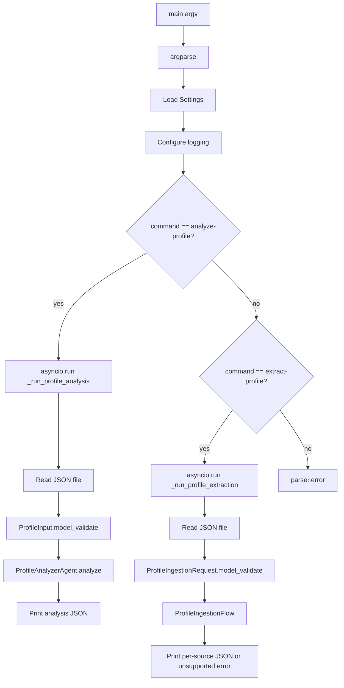

# CLI – terminal interface

## Files

- `app/cli.py` – main implementation
- `app/__main__.py` – enables `python -m app`
- `pyproject.toml` → `[project.scripts] career-ai = "app.cli:main"`

## How to run

Three equivalent forms:

```bash
uv run career-ai analyze-profile examples/sample_profile.json
uv run python -m app analyze-profile examples/sample_profile.json
uv run python -m app.cli analyze-profile examples/sample_profile.json
```

Text extraction (mock LLM, no API key):

```bash
uv run career-ai extract-profile examples/sample_profile_ingestion.json --mock
```

The same mock path with an explicit provider:

```bash
uv run career-ai extract-profile examples/sample_profile_ingestion.json --provider mock
```

Cursor, after `CURSOR_API_KEY` is set in `.env`:

```bash
uv run career-ai extract-profile examples/sample_profile_ingestion.json --provider cursor
```

## Current commands

### `analyze-profile`

```bash
career-ai analyze-profile <profile_path>
```

| Argument | Meaning |
|----------|---------|
| `profile_path` | Path to a JSON file matching the Profile Analyzer input contract (`ProfileInput`) |

## CLI flow


```mermaid
flowchart TD
    A[main argv] --> B[argparse]
    B --> C[Load Settings]
    C --> D[Configure logging]
    D --> E{command == analyze-profile?}
    E -->|yes| F[asyncio.run _run_profile_analysis]
    F --> G[Read JSON file]
    G --> H[ProfileInput.model_validate]
    H --> I[ProfileAnalyzerAgent.analyze]
    I --> J[Print analysis JSON]
    E -->|no| L{command == extract-profile?}
    L -->|yes| M[asyncio.run _run_profile_extraction]
    M --> N[Read JSON file]
    N --> O[ProfileIngestionRequest.model_validate]
    O --> P[ProfileIngestionFlow]
    P --> Q[Print per-source JSON or unsupported error]
    L -->|no| K[parser.error]
```

## `_run_profile_analysis` step by step

1. Read the JSON file
2. Validate into `ProfileInput` (invalid input raises Pydantic error)
3. Open `create_llm_client(LLMProvider.OPENAI, settings)`
4. Inject that client into `ProfileAnalyzerAgent`
5. Run `await agent.analyze(...)`
6. Close the OpenAI client when the block ends
7. Print `analysis.model_dump_json(indent=2)` to stdout
8. Return exit code `0`

## `extract-profile`

```bash
career-ai extract-profile <request_path> [--provider openai|cursor|mock] [--mock]
```

| Argument | Meaning |
|----------|---------|
| `request_path` | Path to a JSON file matching `ProfileIngestionRequest` |
| `--provider` | `openai`, `cursor`, or `mock`, in `LLMProvider` order. Default: `openai` |
| `--mock` | Same as `--provider mock`. Kept for the existing command |

The command resolves `LLMProvider` from `--provider` and `--mock`, then runs:

```python
async with create_llm_client(provider, settings) as llm:
    ...
```

Provider ids are not interpreted again inside the command. `ProfileIngestionFlow` normalizes sources, extracts each text source, and prints `ProfileExtractionResult` JSON. `ProfileExtractionAgent` receives the `StructuredLLMClient` and does not choose the provider. Connection setup and cleanup stay in `create_llm_client`.

| Provider | Client | Requirement |
|----------|--------|-------------|
| `openai` (default) | `StructuredLLM` | `OPENAI_API_KEY` |
| `mock` | `MockStructuredLLM` | None. One canned profile per source, still one result per source |
| `cursor` | `CursorStructuredLLMClient` | `CURSOR_API_KEY`. Output is validated with Pydantic |

`--mock` together with a different `--provider` is an error. `analyze-profile` has no `--provider` flag. It always opens `LLMProvider.OPENAI` through the same context manager.

File and URL sources are valid JSON and exit `1` with `UnsupportedProfileSourceError` on stderr. They are not read or fetched. A missing API key for the selected `extract-profile` provider exits `1` before any provider call. `analyze-profile` still raises that `ValueError` when `OPENAI_API_KEY` is missing.

Details: [Profile ingestion](profile-ingestion.md).

## Logging

Format:

```text
%(asctime)s | %(levelname)s | %(name)s | %(message)s
```

Log level comes from `LOG_LEVEL` in `.env` (default `INFO`).

During a run you will see logs such as:

- Analyzing profile for ...
- Requesting structured completion ...
- Profile analysis complete ... score=...
- Extracting profile facts from source_type=...

The main result (JSON) is printed separately to stdout.

## Sample file

`examples/sample_profile.json` includes:

- Name, headline, about
- Two roles
- Skills
- Career goal toward AI Engineer

You can copy it and adapt it to your real profile.

`examples/sample_profile_ingestion.json` is a two-source text request for `extract-profile`.

## What the CLI still lacks

- Saving output to a file (`--output`)
- Interactive mode
- Reading a CV file or fetching a LinkedIn or portfolio URL
- Reconciliation, human review, and canonical profile persistence

Product inputs and the next milestone are listed in [Architecture](../architecture/overview.md).
