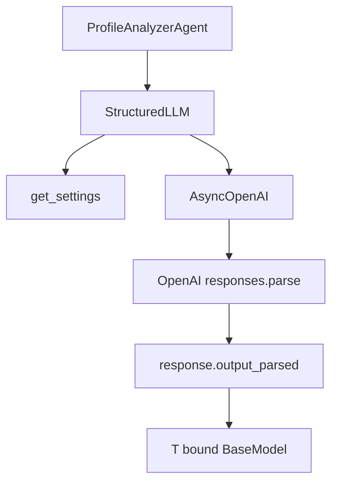
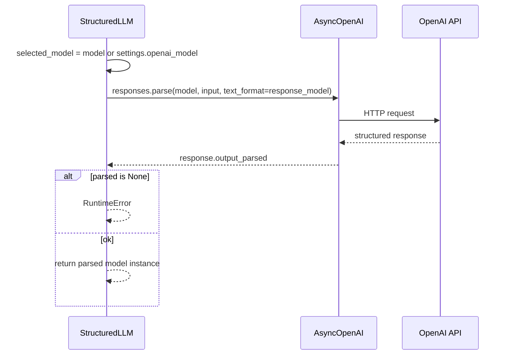

# LLM client – `StructuredLLM`

## File

`app/tools/llm.py`

## Role

A thin OpenAI wrapper that guarantees:

- Async calls
- Structured Outputs
- A validated Pydantic object as the return value

## Component diagram



## `StructuredLLM` class

### `__init__`

| Parameter | Default | Why override |
|-----------|---------|--------------|
| `settings` | `get_settings()` | Tests / custom config |
| `client` | `AsyncOpenAI(...)` | OpenAI mock |

If no API key is set, `require_openai_api_key()` raises `ValueError`.

### `complete_structured(...)`

Parameters:

| Parameter | Meaning |
|-----------|---------|
| `system_prompt` | System instructions |
| `user_prompt` | Data to analyze |
| `response_model` | Pydantic output class |
| `model` | Optional; otherwise from Settings |

Internal flow:



## Why `responses.parse` instead of plain chat completions?

Because we want:

1. A schema enforced by Pydantic
2. Automatic parsing into a Python object
3. Fewer bugs from broken JSON strings

## TypeVar `T`

```python
T = TypeVar("T", bound=BaseModel)
```

This lets the type checker understand:

```python
analysis = await llm.complete_structured(..., response_model=ProfileAnalysis)
# analysis: ProfileAnalysis
```

## How we test without real OpenAI calls

Tests do not call the real `StructuredLLM`.  
They use `MockStructuredLLM`, which returns a fixed result.

Benefits:

- Fast and stable tests
- No API cost
- No network dependency

## Future extension points

| Improvement | Why |
|-------------|-----|
| Retries / timeout | Resilience to network issues |
| Cost/token logging | Cost tracking |
| Provider abstraction | Support Anthropic, etc. |
| Caching | Avoid repeated calls for the same profile |
