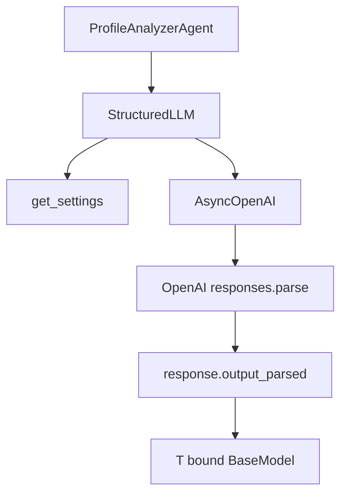
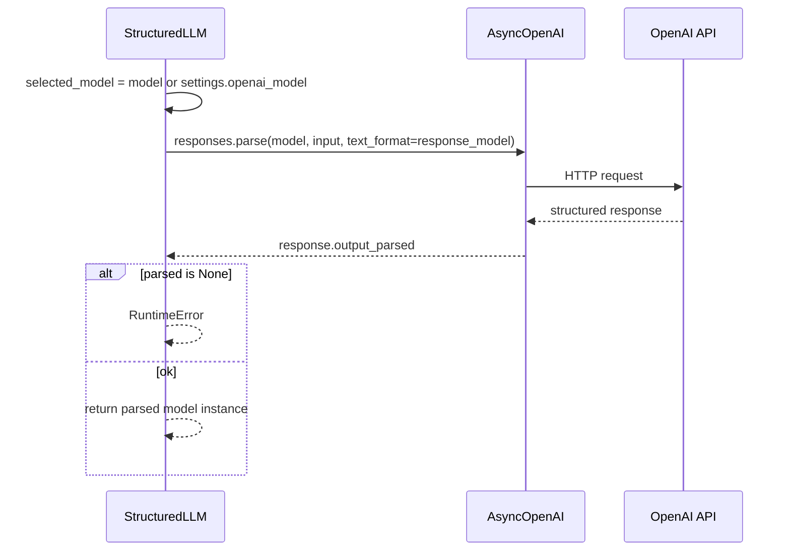

# LLM client – `StructuredLLM`

## File

`app/tools/llm.py`

## Role

A thin OpenAI wrapper that guarantees:

- Async calls
- Structured Outputs
- A validated Pydantic object as the return value

## Component diagram



## `StructuredLLM` class

### `__init__`

| Parameter | Default | Why override |
|-----------|---------|--------------|
| `settings` | `get_settings()` | Tests / custom config |
| `client` | `AsyncOpenAI(...)` | OpenAI mock |

If no API key is set, `require_openai_api_key()` raises `ValueError`.

### `complete_structured(...)`

Parameters:

| Parameter | Meaning |
|-----------|---------|
| `system_prompt` | System instructions |
| `user_prompt` | Data to analyze |
| `response_model` | Pydantic output class |
| `model` | Optional; otherwise from Settings |

Internal flow:



## Why `responses.parse` instead of plain chat completions?

Because we want:

1. A schema enforced by Pydantic
2. Automatic parsing into a Python object
3. Fewer bugs from broken JSON strings

## TypeVar `T`

```python
T = TypeVar("T", bound=BaseModel)
```

This lets the type checker understand:

```python
analysis = await llm.complete_structured(..., response_model=ProfileAnalysis)
# analysis: ProfileAnalysis
```

## How we test without real OpenAI calls

Tests do not call the real `StructuredLLM`.
They use `MockStructuredLLM`, which returns a fixed result.

`response` is used when the schema is `ProfileAnalysis`. `extraction_response` is used when the schema is `ExtractedCandidateProfile`. Both agents depend on `StructuredLLMClient`, not on OpenAI.

Benefits:

- Fast and stable tests
- No API cost
- No network dependency

## Provider contract

**Implemented.** Agents depend on `StructuredLLMClient.complete_structured(...)`, not on a vendor SDK.

| Provider | Class | Used by |
|----------|-------|---------|
| OpenAI | `StructuredLLM` | `analyze-profile`, and `extract-profile` by default |
| Mock | `MockStructuredLLM` | tests and `extract-profile --mock` |
| Cursor | `CursorStructuredLLMClient` | `extract-profile --provider cursor` |

`ProfileExtractionAgent` does not know which provider is injected.

## Cursor provider

**Implemented** for text extraction. Optional. The package is the official Python SDK `cursor-sdk` (imported as `cursor_sdk`). There is no TypeScript bridge in this application.

`cursor-sdk` is an **agent SDK**, not an OpenAI-compatible Chat Completions endpoint. It has no structured-output / Pydantic response format. The adapter therefore:

1. Sends the agent system prompt, user prompt, and the Pydantic JSON schema as one prompt.
2. Runs a **local** Cursor agent with `AsyncAgent.prompt` (one-shot: create, wait, dispose).
3. Reads the final assistant text from `RunResult.result`.
4. Accepts raw JSON, or one markdown fence around the entire reply when the fence language is empty or `json`.
5. Rejects prose, other fence languages, and invalid JSON.
6. Validates with Pydantic (`json.loads`, then `model_validate`). Schema failures raise `ValidationError`.

A run whose status is not `finished` is not parsed.

### Why async, and why local

`ProfileExtractionAgent` is async, so the adapter uses `AsyncClient.launch_bridge` and `AsyncAgent.prompt`. The CLI holds one async client for the command and closes it afterward. Each source is a new one-shot prompt, so two sources do not share a conversation.

Tool restrictions exist for **local** agents only. Cloud agents cannot take `tools=[]`, so this path does not use a cloud agent.

### Authentication and model

| Env var | Settings field | Role |
|---------|----------------|------|
| `CURSOR_API_KEY` | `cursor_api_key` | User or service-account key. Passed as `api_key`. Never logged. |
| `CURSOR_MODEL` | `cursor_model` | Model id. Default `composer-2.5`, the SDK quick-start model. |

`--provider cursor` fails before any SDK call when the key is missing. The default is not chosen by `Cursor.models.list()`; that would be an extra account call, and the catalog depends on the key's team.

### Tools and capabilities

The extraction run is text in, JSON text out. `AgentOptions` is:

| Option | Value | Effect |
|--------|-------|--------|
| Runtime | `local` | Required for an empty tool allowlist |
| `local.cwd` and bridge workspace | Empty temporary directory | Not the Career AI repository |
| `tools` | `[]` | No built-in tools. The model can only respond with text |
| `mcp_servers` | unset | No inline MCP |
| `agents` | unset | No inline subagents |
| `local.custom_tools` | unset | No Python tools |
| `local.setting_sources` | unset | SDK default: inline config only, not project/user/team/plugins/MDM |
| `mode` | unset | Server starts in agent mode. With no tools it cannot edit files or run commands |
| `cloud` | unset | Not a cloud coding agent |

`tools=[]` is the SDK's documented switch for "no built-in tools". Shell, edit, read, web search, MCP, and subagents are not offered. Project hooks under the Career AI repo are not on this workspace because `cwd` is an empty temp directory. Hooks remain file-based; this adapter does not add a programmatic hook callback.

### Tests

Unit tests fake `launch_cursor_client` / `prompt_cursor` or inject a text completion. They do not call Cursor and do not need a real key.

## Future extension points

| Improvement | Why |
|-------------|-----|
| Retries / timeout | Resilience to network issues |
| Cost/token logging | Cost tracking |
| More providers | Anthropic or a local model, behind the same protocol |
| Caching | Avoid repeated calls for the same profile |

Task-based model routing, fallbacks, and evaluation are not extensions of this client. They are recorded in [Future architecture](../architecture/future-architecture.md#model-routing) and stay unbuilt until a second task needs a different policy.
