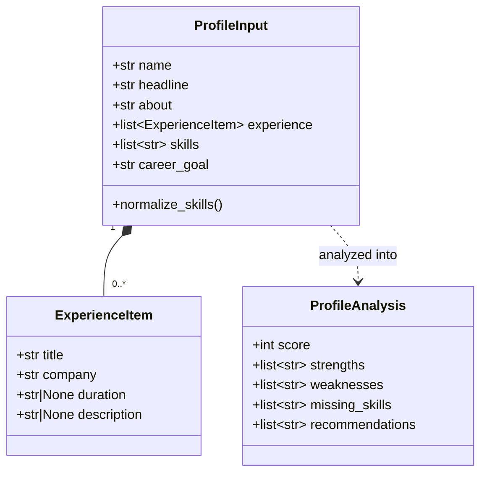
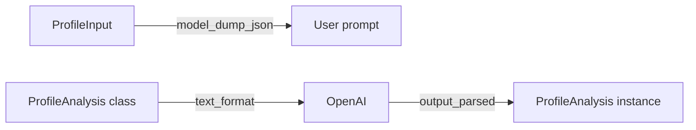

# Models (Pydantic) – Profile Analyzer I/O contracts

## File

`app/models/profile.py`

These models are the **implemented agent I/O contract** for the Profile Analyzer. They are not the persistent [Candidate Profile](../architecture/data.md#persistent-candidate-state), and they are not the [profile ingestion](profile-ingestion.md) contract.

- `ProfileInput.skills` is `list[str]` with in-memory normalize/dedupe.
- Persistence treats **Skill** (and Company) as reusable ORM entities in `app/db/models/`. See [Data architecture](../architecture/data.md) and [Database](../development/database.md).

## Why this is the most important implemented contract

The models define:

1. **What may enter** the agent
2. **What may come back** from the LLM
3. **What the result looks like** even without opening agent code

This is the Profile Analyzer's internal I/O API, not the persistence or ingestion contract.

## Model diagram



## `ExperienceItem`

One work-experience entry in the analyzer input. Company is a string and duration is a display string — not the persisted `Experience` ORM entity.

| Field | Required? | Meaning |
|-------|-----------|---------|
| `title` | yes | Job title |
| `company` | yes | Company name |
| `duration` | no | e.g. `2023 – Present` |
| `description` | no | What you did / achievements |

## `ProfileInput` – Profile Analyzer input

Analysis-only. The CLI validates a JSON file into this model and passes it to the agent. Do not reuse it as the canonical persistence model or as the ingestion contract (`ProfileIngestionRequest`).

| Field | Required? | Meaning |
|-------|-----------|---------|
| `name` | yes | Full name |
| `headline` | yes | LinkedIn headline |
| `about` | no (default `""`) | About summary |
| `experience` | no (empty list) | Work experience |
| `skills` | no (empty list) | Skills |
| `career_goal` | yes | Target career direction |

### Special validator on `skills`

```text
["Python", " python ", "FastAPI", "PYTHON"]
                    │
                    ▼ normalize + dedupe
              ["Python", "FastAPI"]
```

- Trims whitespace
- Drops empty values
- Removes case-insensitive duplicates
- Keeps first-seen order

## `ProfileAnalysis` – structured output

| Field | Constraints | Meaning |
|-------|-------------|---------|
| `score` | `0..100` | Profile strength for the goal |
| `strengths` | at least one item | Strengths |
| `weaknesses` | at least one item | Weak areas |
| `missing_skills` | list | Skills missing for the goal |
| `recommendations` | at least one item | Concrete next actions |

### Example output

```json
{
  "score": 71,
  "strengths": ["Python", "Backend"],
  "weaknesses": ["Limited AI Agents portfolio evidence"],
  "missing_skills": ["RAG", "MCP", "AI Agents"],
  "recommendations": ["Improve headline", "Add measurable achievements"]
}
```

## How models integrate with OpenAI Structured Outputs



`ProfileAnalysis` is sent to OpenAI as a schema.
The OpenAI SDK returns a ready Pydantic object.

The optional Cursor extraction path does not use that OpenAI API. `CursorStructuredLLMClient` sends the Pydantic JSON schema in the prompt, then validates the agent's text with the same model classes. See [LLM client](llm-client.md).

## Public exports

`app/models/__init__.py` exports the analyzer models:

- `ExperienceItem`
- `ProfileInput`
- `ProfileAnalysis`

Ingestion and extraction models are exported from the same package. See [Profile ingestion](profile-ingestion.md).

So you can write:

```python
from app.models import ProfileInput, ProfileAnalysis
```

## Tests that protect the contract

See `tests/test_models_profile.py`:

1. Skills normalization
2. Rejection of `score=120`
3. Acceptance of a valid payload

Details: [Testing](../development/testing.md)
