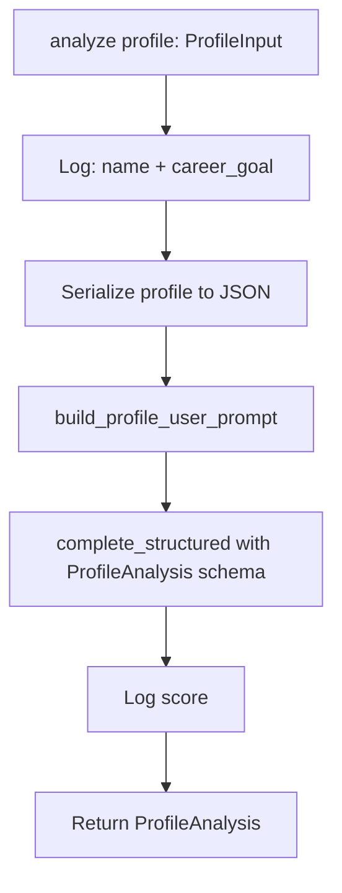
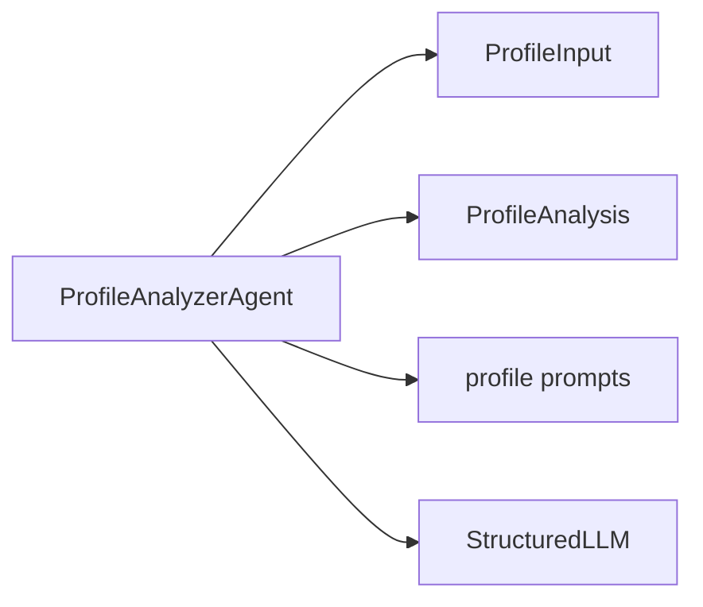

# Profile Analyzer Agent

## Files

- `app/agents/profile/agent.py` – implementation
- `app/agents/profile/__init__.py` – exports `ProfileAnalyzerAgent`

## What the agent does

**Implemented** scope: takes an already-structured professional profile + career goal and returns a structured analysis.

This is not the full [Profile Ingestion / Analysis](../architecture/overview.md#profile-ingestion-analysis) component. The agent does not read a CV or LinkedIn PDF, persist a canonical profile, or resolve source conflicts.

- Score
- Strengths
- Weaknesses
- Missing skills
- Recommendations

## The class

```python
class ProfileAnalyzerAgent:
    def __init__(self, llm: StructuredLLMClient | None = None) -> None: ...
    async def analyze(self, profile: ProfileInput) -> ProfileAnalysis: ...
```

### Why a constructor with `llm=`?

So you can do:

```python
# Production
agent = ProfileAnalyzerAgent()

# Tests
agent = ProfileAnalyzerAgent(llm=fake_llm)
```

Simple, clean dependency injection.

## `analyze` steps



In code:

1. Log start
2. `profile.model_dump_json(indent=2)`
3. Build user prompt
4. Call LLM with system prompt + schema
5. Log completion with score
6. Return the result

## What the agent does **not** do (on purpose)

| Not done | Why |
|----------|-----|
| Does not read files from disk | CLI responsibility |
| Does not print JSON | Interface responsibility |
| Does not persist a Candidate Profile | Proposed data layer; see [Data architecture](../architecture/data.md) |
| Does not ingest CV / LinkedIn sources | Proposed Profile Ingestion; see [Architecture](../architecture/overview.md) |
| Does not rewrite LinkedIn copy | Proposed LinkedIn Optimization |
| Does not search or match jobs | Proposed Job Search / Matching |

The agent stays focused: **Analyze only**.

## Dependencies



## Example usage

```python
from app.agents.profile import ProfileAnalyzerAgent
from app.models import ProfileInput

profile = ProfileInput(
    name="Shira Ozana",
    headline="Python Developer | Backend",
    about="...",
    skills=["Python", "FastAPI"],
    career_goal="AI Engineer focused on agents and RAG",
)

agent = ProfileAnalyzerAgent()
analysis = await agent.analyze(profile)
print(analysis.score, analysis.recommendations)
```

Or via CLI:

```bash
uv run career-ai analyze-profile examples/sample_profile.json
```

## Why this is a solid portfolio building block

In an interview you can explain:

1. Explicit data contracts (Pydantic)
2. Clear separation of concerns (Agent / Prompts / Tools)
3. Structured Outputs instead of brittle parsing
4. Tests with a fake LLM
5. A clear path to multi-agent expansion

## Natural next enhancements for this same agent

- Weighted scoring (headline 20%, experience 40%, ...)
- Comparison against a specific job description
- Evaluation suite with gold examples

Profile history and persistence belong to the canonical Candidate Profile and related history records, not a separate Memory/RAG agent. See [Data architecture](../architecture/data.md).
