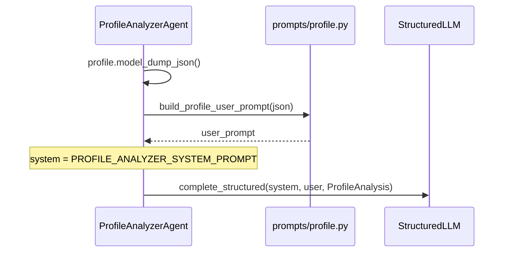

# Prompts

## File

`app/prompts/profile.py` — Profile Analyzer. Extraction prompts are separate: `app/prompts/profile_extraction.py`. See [Profile ingestion](profile-ingestion.md).

## Why prompts live in a separate folder

To separate:

- **Agent logic** (sequence of steps)
- **LLM wording** (textual instructions)

You can improve prompts without touching business code.

## What the file contains

### 1. `PROFILE_ANALYZER_SYSTEM_PROMPT`

Defines the model role:

- Career coach + LinkedIn analyst
- Analyze against `career_goal`
- Specific feedback, not generic advice

Score bands:

| Range | Meaning |
|-------|---------|
| 0–39 | Weak positioning for the target role |
| 40–59 | Partial fit; major gaps |
| 60–79 | Solid foundation; needs focused improvements |
| 80–100 | Strong, market-ready profile |

Rules:

1. Strengths grounded in real experience/skills
2. Weaknesses that explain marketability damage
3. High-impact missing skills (not an endless list)
4. Actionable recommendations
5. Return only schema fields

### 2. `build_profile_user_prompt(profile_json)`

Builds the user message:

```text
Analyze this professional profile and return a structured assessment.

Profile JSON:
{ ... ProfileInput as JSON ... }
```

## How it connects



## Prompt role split

| Part | Role |
|------|------|
| System prompt | Who you are and the rules |
| User prompt | The specific data to analyze |
| `response_model` | The JSON shape to return |

Together they produce more stable answers than one long mixed prompt.

## Future improvement ideas

- Add few-shot examples if scores are inconsistent
- Split prompts by language (Hebrew/English)
- Add a more detailed rubric (headline / about / experience)
- Version prompts (`v1`, `v2`) once evaluation starts. The principle, without a prompt registry, is in [Future architecture](../architecture/future-architecture.md#prompt-versioning).
