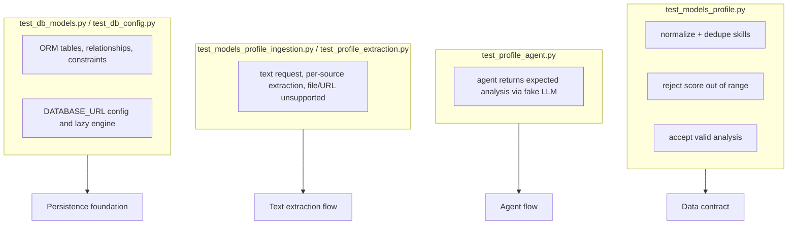

# Testing

## Location

```text
tests/
├── __init__.py
├── test_models_profile.py
├── test_models_profile_ingestion.py
├── test_profile_agent.py
├── test_profile_extraction.py
├── test_db_models.py
└── test_db_config.py
```

## How to run

```bash
uv run pytest
uv run pytest -q
uv run pytest tests/test_models_profile.py -v
```

Relevant settings in `pyproject.toml`:

```toml
[tool.pytest.ini_options]
asyncio_mode = "auto"
testpaths = ["tests"]
pythonpath = ["."]
```

## Logical coverage map



## Test details

### `test_profile_input_normalizes_and_dedupes_skills`

Ensures:

```python
skills=["Python", " python ", "FastAPI", "PYTHON"]
```

becomes:

```python
["Python", "FastAPI"]
```

### `test_profile_analysis_score_bounds`

Ensures `score=120` fails with `ValidationError`.

### `test_profile_analysis_accepts_valid_payload`

Ensures a valid payload is constructed correctly.

### `test_profile_agent.py`

Tests the agent end-to-end **without OpenAI**:

1. Creates `MockStructuredLLM` returning a fixed result
2. Injects it via `ProfileAnalyzerAgent(llm=...)`
3. Asserts the result matches expectations
4. Asserts exactly one LLM call happened
5. Asserts the schema sent is `ProfileAnalysis`
6. Asserts the user prompt contains the person's name

### Profile ingestion tests

`test_models_profile_ingestion.py` checks the ingestion and extraction contracts: valid text, multiple sources, empty or invalid sources, source type, partial dates, and rejection of `user_id` and analysis fields.

`test_profile_extraction.py` checks normalization, one agent call per text source, isolated prompts, mock workflow execution, file/URL failure before any model call, the `extract-profile --mock` CLI, and that the Profile Analyzer still returns `ProfileAnalysis`.

No test calls OpenAI or PostgreSQL.

### `test_db_models.py`

Inspects SQLAlchemy metadata only (no database connection):

- expected tables are present
- unimplemented entities (`TailoredCV`, workflow state, education, `SearchExecution`) are absent
- `CandidateProfile` has no `target_title`; `JobSearchRequest` does
- `JobMatch` references `JobSearchRequest` + `Job`, with a uniqueness constraint
- `ResumeVersion` allows original/generic/tailored and a nullable `job_match_id`

### `test_db_config.py`

- `DATABASE_URL` is optional for the existing CLI
- `require_database_url()` fails clearly when unset
- `postgres://` / `postgresql://` URLs are rewritten to the psycopg3 dialect
- importing the session module does not create an engine

PostgreSQL integration tests (applying Alembic against a real database) are a future step. See [Database](database.md).

## Why a Fake LLM instead of mocking the SDK?

Because we test **our usage contract**:

```python
await llm.complete_structured(...)
```

not the internal details of the OpenAI SDK.

## What is not covered yet

| Gap | Future test type |
|-----|------------------|
| `analyze-profile` file reading against a live model | optional; `extract-profile --mock` is covered |
| Missing API key failure | unit test for `require_openai_api_key` |
| Real OpenAI integration | optional marked test (`@pytest.mark.integration`) |
| Prompt regression | evaluation suite with gold examples |
| Alembic against real PostgreSQL | optional marked integration test |

## Lint

In addition to pytest:

```bash
uv run ruff check app tests alembic
```

Ruff checks style, imports, and basic issues based on `pyproject.toml`.
