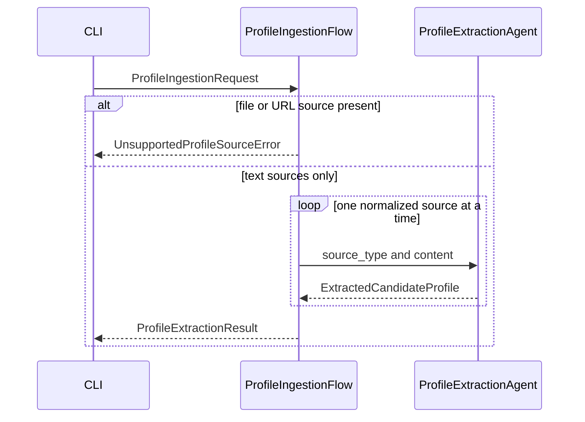

# Profile ingestion flow

**Implemented** path: text in, per-source extracted facts out. Nothing is written to PostgreSQL.

The agent sees one source per call. `ProfileExtractionResult` keeps those results side by side. It is not a canonical `CandidateProfile`.

The CLI selects the structured LLM provider (`mock`, `openai`, or `cursor`). The agent calls `StructuredLLMClient` and does not import a provider SDK.

## What this flow does not do

| Step | Status |
|------|--------|
| Read a CV file or fetch a URL | Planned; request fields exist; execution stops with a clear error |
| Reconcile sources with each other or with an existing profile | Planned |
| Human review of conflicts | Planned |
| Merge into `CandidateProfile` | Planned. Rule already decided: merge, no implicit deletion |
| Persist extraction output | Not implemented |

Details and the date representation: [Profile ingestion and extraction](../design/profile-ingestion.md).
