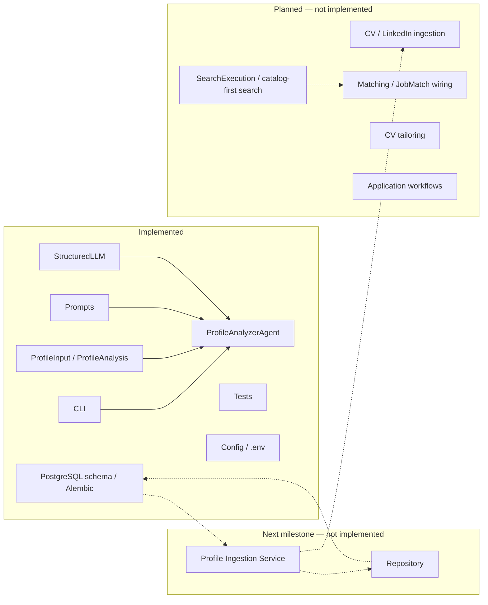

# Career AI documentation

Career AI helps a user manage and optimize the job-search process.

The **running codebase** is a Profile Analyzer CLI (structured JSON in, structured analysis out) plus a PostgreSQL schema that is not wired to agents yet. The deployable shape is a **modular monolith** — one backend, one database — not microservices.

The **product MVP and planned architecture** are documented separately from that implementation.

## Where to document what

| You want to describe… | Write in |
|-----------------------|----------|
| System shape, layers, package layout | [`architecture/`](architecture/overview.md) |
| Persistent domain, ingestion, data access | [`architecture/data.md`](architecture/data.md) |
| Job Search pipeline (planned) | [`architecture/job-search.md`](architecture/job-search.md) |
| A specific implemented feature or component | [`design/`](design/profile-agent.md) |
| A durable architectural decision | [`adr/`](adr/001-postgresql.md) |
| An end-to-end user or system path | `flows/` (create when needed) |
| Setup, tooling, testing, conventions | [`development/`](development/documentation.md) |

See [Documentation guidelines](development/documentation.md) for when a code change needs a docs update.

## Current status



Details: [Architecture overview](architecture/overview.md) · [Data architecture](architecture/data.md) · [Job Search](architecture/job-search.md)

## Quick start

```bash
uv sync --extra dev
cp .env.example .env   # if you do not have .env yet
# Add OPENAI_API_KEY in .env

uv run career-ai analyze-profile examples/sample_profile.json
uv run pytest
```

Preview these docs locally:

```bash
uv sync --extra dev --extra docs
uv run mkdocs serve
```
